# 系统集成流程图

## 🔄 核心业务流程

### **1. 玩家登录流程**

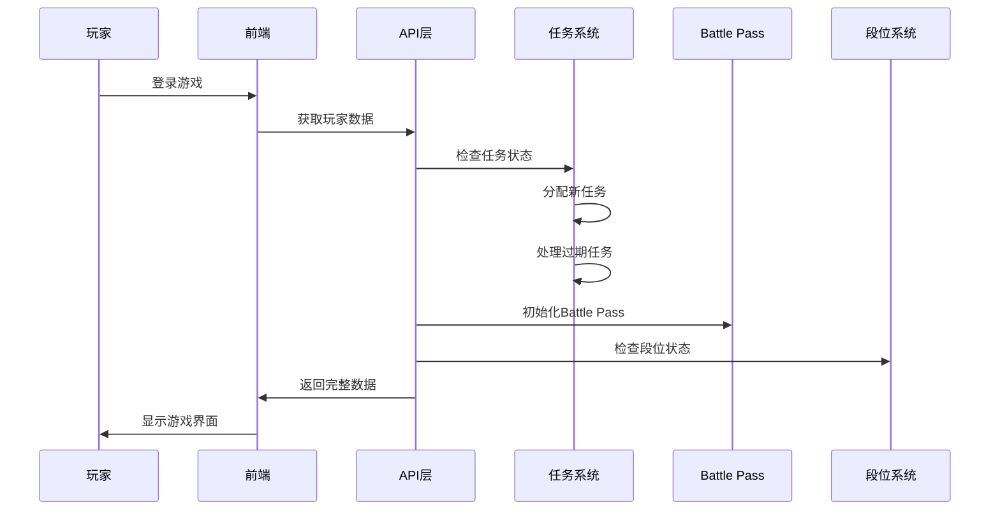

### **2. 游戏完成流程**

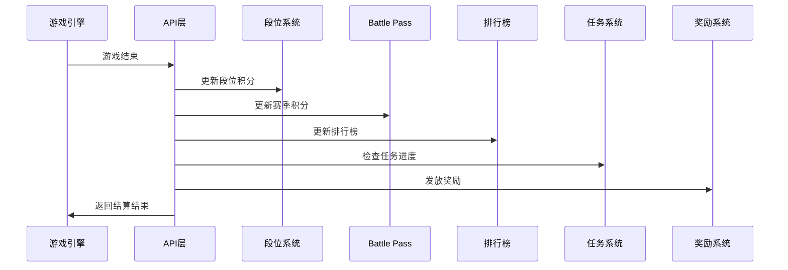

### **3. 任务完成流程**

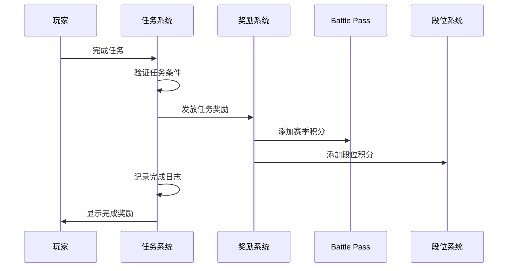

### **4. 赛季重置流程**

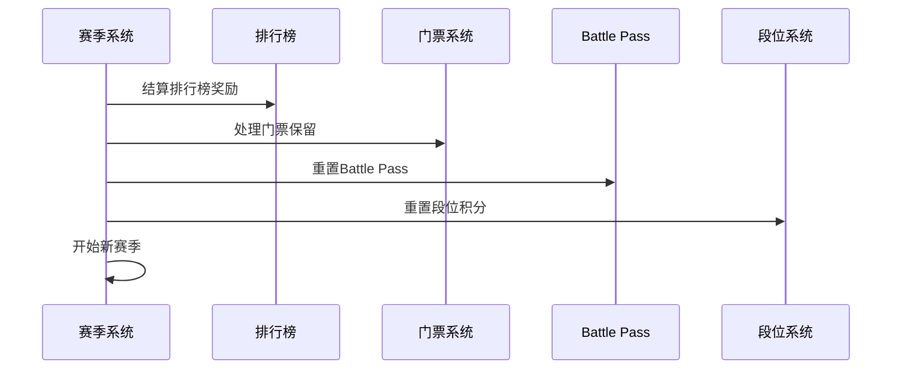

## 🎯 数据流向图

### **积分流向**

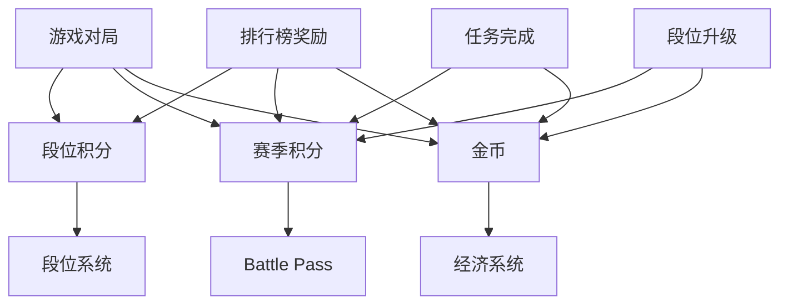

### **奖励流向**

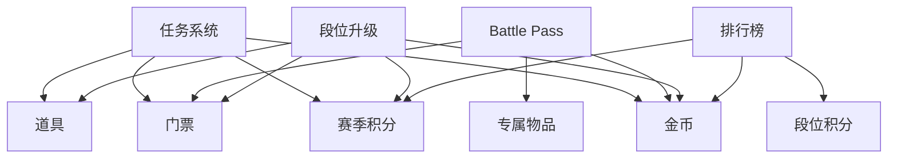

## 🔧 系统交互图

### **API调用关系**

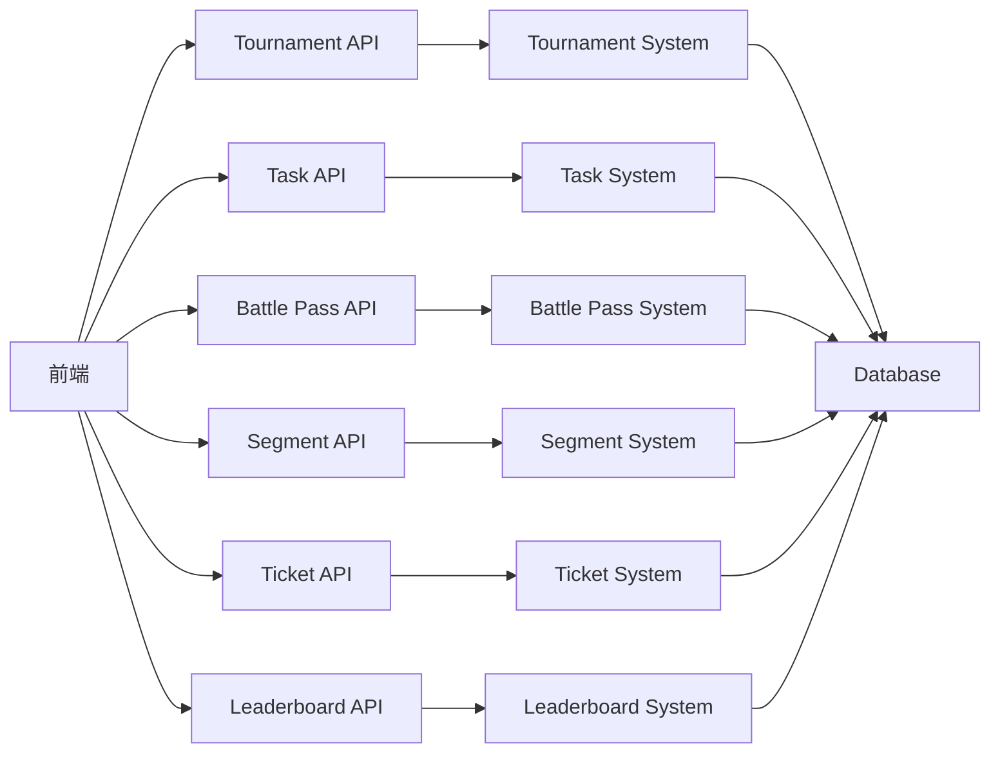

### **数据库表关系**

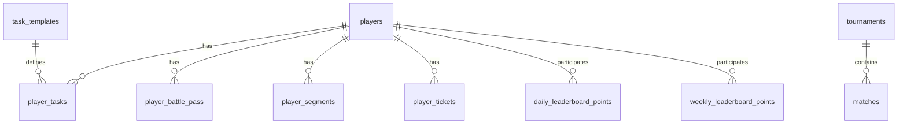

## 📊 监控指标流

### **关键指标收集**

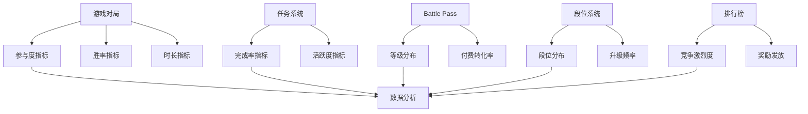

## 🚀 扩展点设计

### **新功能集成点**

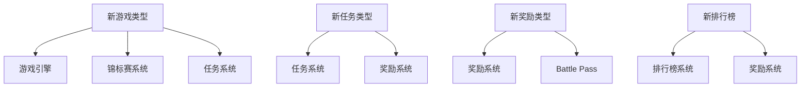

### **插件化架构**

```typescript
// 游戏类型插件
interface GamePlugin {
    type: string;
    name: string;
    rules: GameRules;
    rewards: GameRewards;
    integration: {
        taskSystem: boolean;
        leaderboard: boolean;
        battlePass: boolean;
    };
}

// 任务类型插件
interface TaskPlugin {
    type: string;
    condition: TaskCondition;
    rewards: TaskRewards;
    integration: {
        battlePass: boolean;
        segment: boolean;
    };
}

// 奖励类型插件
interface RewardPlugin {
    type: string;
    value: any;
    integration: {
        battlePass: boolean;
        segment: boolean;
        leaderboard: boolean;
    };
}
```

## 🔄 实时数据流

### **WebSocket连接**

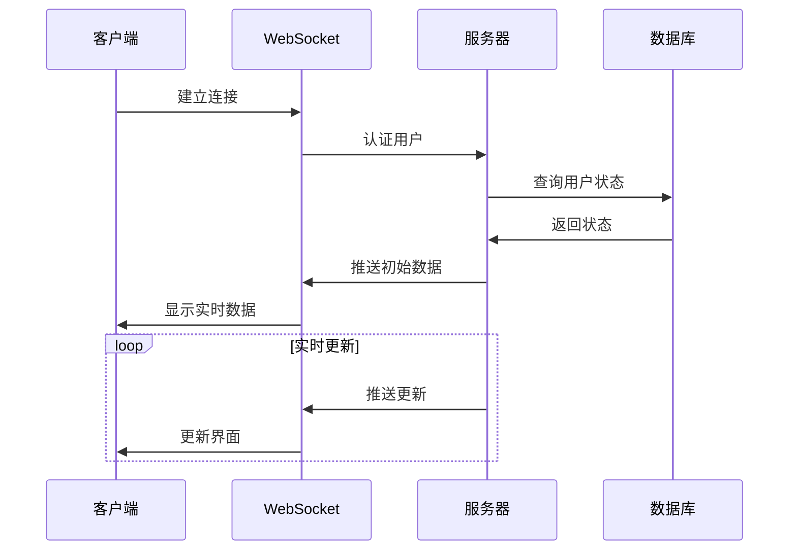

### **事件驱动架构**

```typescript
// 事件类型
interface GameEvent {
    type: 'game_complete' | 'task_complete' | 'segment_upgrade';
    uid: string;
    data: any;
    timestamp: string;
}

// 事件处理器
interface EventHandler {
    handle(event: GameEvent): Promise<void>;
}

// 事件分发
class EventDispatcher {
    private handlers: Map<string, EventHandler[]>;
    
    register(eventType: string, handler: EventHandler): void;
    dispatch(event: GameEvent): Promise<void>;
}
```

这个系统集成流程图展示了整个游戏平台的复杂交互关系，为开发和维护提供了清晰的指导！ 