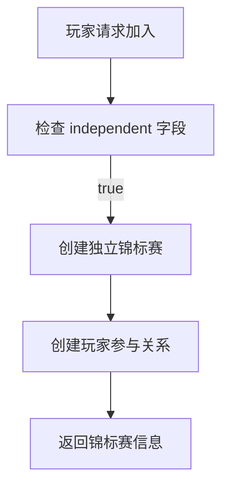
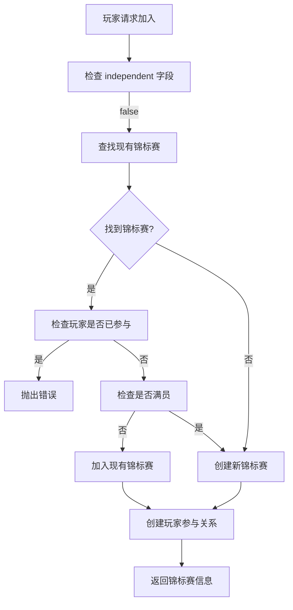

# 锦标赛加入逻辑优化

## 概述

我们优化了 `base.ts` 中的 `join` 方法，利用新添加的 `independent` 字段来改进锦标赛加入逻辑。新的逻辑能够智能地处理独立和非独立锦标赛，提供更好的用户体验。

## 核心改进

### 1. 统一的锦标赛查找和创建逻辑

通过 `independent` 字段，我们将 `createIndependentTournament` 的逻辑融合到统一的 `findOrCreateTournament` 中：

```typescript
// 获取锦标赛的独立状态
const { getIndependentFromTournamentType } = await import("../utils/tournamentTypeUtils.js");
const isIndependent = await getIndependentFromTournamentType(ctx, tournamentType);

// 统一的锦标赛查找和创建逻辑
if (this.findOrCreateTournament) {
    // 使用自定义的查找逻辑
    tournament = await this.findOrCreateTournament(ctx, {
        uid, gameType, tournamentType, player, season, config, now,
        isIndependent, // 传递独立状态给自定义逻辑
        attemptNumber: attempts + 1 // 传递尝试次数
    });
} else {
    // 使用默认的统一查找逻辑
    // findOrCreateTournament 现在是 base.ts 的内部函数
tournament = await findOrCreateTournament(ctx, {
        uid, gameType, tournamentType, player, season, config, now,
        isIndependent, attemptNumber: attempts + 1
    });
}
```

### 2. 独立锦标赛处理

**特点：**
- 每次玩家加入都创建新的锦标赛
- 适合单人游戏或需要隔离的比赛
- 每个玩家都有独立的比赛环境

**使用场景：**
- 单人游戏锦标赛
- 需要隔离的比赛环境
- 特殊邀请赛
- 测试锦标赛

**处理流程：**
1. 检查 `independent` 字段为 `true`
2. 直接调用 `createIndependentTournament`
3. 创建新的锦标赛实例
4. 玩家获得独立的比赛环境

### 3. 非独立锦标赛处理

**特点：**
- 多个玩家可以加入同一个锦标赛
- 支持多人游戏和社交互动
- 智能的锦标赛查找和创建逻辑

**使用场景：**
- 多人游戏锦标赛
- 每日/每周锦标赛
- 需要玩家互动的比赛
- 排位赛

**处理流程：**
1. 检查 `independent` 字段为 `false`
2. 查找现有的非独立锦标赛
3. 检查玩家是否已经参与
4. 检查锦标赛是否已满员
5. 决定加入现有锦标赛或创建新锦标赛

## 详细流程

### 独立锦标赛流程



### 非独立锦标赛流程



## 统一函数优势

### 1. 代码简化

**之前：** 需要分别处理独立和非独立锦标赛
```typescript
if (isIndependent) {
    // 独立锦标赛逻辑
    const tournamentId = await createIndependentTournament(ctx, { ... });
} else {
    // 非独立锦标赛逻辑
    if (this.findOrCreateTournament) {
        tournament = await this.findOrCreateTournament(ctx, { ... });
    } else {
        // 复杂的查找逻辑
    }
}
```

**现在：** 统一的处理逻辑
```typescript
if (this.findOrCreateTournament) {
    tournament = await this.findOrCreateTournament(ctx, { 
        ...params, 
        isIndependent, 
        attemptNumber: attempts + 1 
    });
} else {
    tournament = await findOrCreateTournamentUnified(ctx, { 
        ...params, 
        isIndependent, 
        attemptNumber: attempts + 1 
    });
}
```

### 2. 逻辑统一

- **独立锦标赛**：自动调用 `createIndependentTournament`
- **非独立锦标赛**：自动调用查找和创建逻辑
- **自定义逻辑**：通过 `findOrCreateTournament` 方法支持自定义处理

### 3. 参数传递

统一的参数接口：
```typescript
interface TournamentCreationParams {
    uid: string;
    gameType: string;
    tournamentType: string;
    player: any;
    season: any;
    config: any;
    now: any;
    timeIdentifier?: string;
    isIndependent?: boolean; // 新增：独立状态
    attemptNumber?: number;  // 新增：尝试次数
}
```

## 工具函数

### 1. 统一查找和创建函数

```typescript
// 统一的锦标赛查找和创建函数
export async function findOrCreateTournamentUnified(ctx: any, params: {
    uid: string;
    gameType: string;
    tournamentType: string;
    player: any;
    season: any;
    config: any;
    now: any;
    isIndependent: boolean;
    attemptNumber: number;
}) {
    if (isIndependent) {
        // 独立锦标赛：每次加入都创建新的锦标赛
        return await createIndependentTournament(ctx, { ...params, attemptNumber });
    } else {
        // 非独立锦标赛：查找现有锦标赛或创建新锦标赛
        // ... 复杂的查找逻辑
    }
}
```

### 2. 锦标赛查找工具

```typescript
// 查找现有的非独立锦标赛
const existingTournament = await findExistingNonIndependentTournament(ctx, {
    tournamentType,
    gameType,
    segmentName: player.segmentName,
    now
});

// 检查玩家是否已经参与
const alreadyJoined = await isPlayerInTournament(ctx, {
    uid,
    tournamentId: existingTournament._id
});

// 检查锦标赛是否已满员
const isFull = await isTournamentFull(ctx, existingTournament._id, maxPlayers);
```

### 2. 锦标赛创建工具

```typescript
// 创建独立锦标赛
const tournamentId = await createIndependentTournament(ctx, {
    uid,
    gameType,
    tournamentType,
    player,
    season,
    config,
    now,
    attemptNumber: attempts + 1
});

// 创建非独立锦标赛
const tournamentId = await createTournament(ctx, {
    uid,
    gameType,
    tournamentType,
    player,
    season,
    config,
    now
});
```

## 配置示例

### 独立锦标赛配置

```json
{
  "typeId": "special_invitational",
  "name": "特别邀请赛",
  "independent": true,
  "timeRange": "total",
  "gameType": "ludo",
  "category": "special",
  "matchRules": {
    "maxPlayers": 1,
    "isSingleMatch": true
  }
}
```

### 非独立锦标赛配置

```json
{
  "typeId": "daily_quick_match",
  "name": "每日快速比赛",
  "independent": false,
  "timeRange": "daily",
  "gameType": "ludo",
  "category": "daily",
  "matchRules": {
    "maxPlayers": 4,
    "isSingleMatch": false
  }
}
```

## 错误处理

### 1. 重复参与检查

```typescript
if (alreadyJoined) {
    throw new Error("您已经参与了这个锦标赛");
}
```

### 2. 满员处理

```typescript
if (isFull) {
    console.log(`锦标赛 ${existingTournament._id} 已满员，创建新的锦标赛`);
    // 创建新的锦标赛
}
```

### 3. 配置验证

```typescript
// 验证锦标赛类型存在
const tournamentTypeConfig = await validateJoinConditions(ctx, { 
    uid, gameType, tournamentType, player, season 
});

// 获取独立状态
const isIndependent = await getIndependentFromTournamentType(ctx, tournamentType);
```

## 性能优化

### 1. 索引优化

- 使用 `by_type_status` 索引快速查找锦标赛
- 使用 `by_uid_tournament` 索引检查玩家参与状态
- 使用 `by_tournament` 索引统计玩家数量

### 2. 批量查询

- 一次性获取锦标赛列表
- 批量检查玩家参与状态
- 减少数据库查询次数

### 3. 缓存考虑

- 锦标赛配置可以缓存
- 玩家参与状态可以缓存
- 减少重复查询

## 监控和日志

### 1. 操作日志

```typescript
console.log(`创建独立锦标赛: ${tournamentType}`);
console.log(`查找或创建非独立锦标赛: ${tournamentType}`);
console.log(`加入现有锦标赛: ${existingTournament._id}`);
console.log(`锦标赛 ${existingTournament._id} 已满员，创建新的锦标赛`);
```

### 2. 性能监控

- 锦标赛查找时间
- 玩家参与检查时间
- 锦标赛创建时间
- 错误率统计

## 测试覆盖

### 1. 单元测试

- `tournamentFinder.test.ts` - 锦标赛查找逻辑测试
- `tournamentTypeUtils.test.ts` - 工具函数测试

### 2. 集成测试

- 独立锦标赛创建流程
- 非独立锦标赛查找和加入流程
- 错误场景处理

## 使用示例

### 前端调用

```typescript
// 加入锦标赛
const result = await joinTournament({
    uid: "user123",
    gameType: "ludo",
    tournamentType: "daily_quick_match"
});

console.log("加入结果:", result);
```

### 后端处理

```typescript
// 在 handler 中
const result = await this.join(ctx, {
    uid,
    gameType,
    tournamentType,
    player,
    season
});

return result;
```

## 总结

通过这次优化，我们实现了：

1. **智能决策** - 基于 `independent` 字段自动选择处理策略
2. **更好的用户体验** - 减少重复参与，支持多人互动
3. **更高的性能** - 优化查询逻辑，减少数据库访问
4. **更强的可维护性** - 清晰的代码结构和完善的错误处理

新的加入逻辑能够更好地支持不同类型的锦标赛需求，提供更灵活和高效的锦标赛管理。 