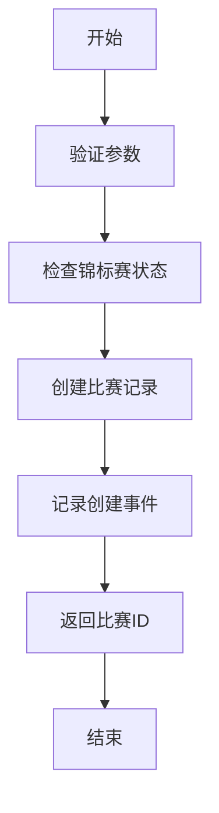
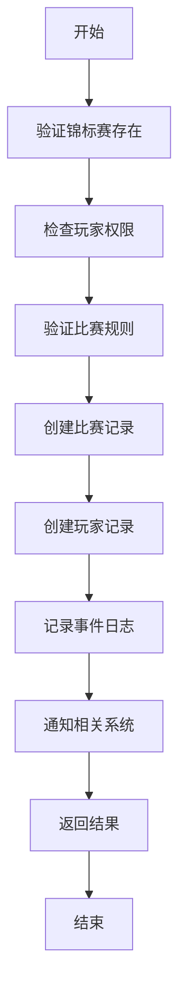

# Match 创建机制和方式

## 概述

Match（比赛）的创建是比赛系统的核心功能之一。根据不同的比赛类型和业务需求，系统提供了多种创建 match 的机制和方式。

## 创建机制分类

### 1. 按触发方式分类

#### **手动创建 (Manual Creation)**
- 由玩家主动触发
- 通过 UI 界面操作
- 需要玩家明确选择

#### **自动创建 (Automatic Creation)**
- 系统自动触发
- 基于规则和条件
- 无需玩家干预

#### **事件驱动创建 (Event-Driven Creation)**
- 响应特定事件
- 基于状态变化
- 异步处理

### 2. 按创建时机分类

#### **锦标赛加入时创建**
```typescript
// 在 baseHandler.join 中
if (config.rules?.createInitialMatch !== false) {
  await ctx.db.insert("matches", {
    tournamentId,
    gameType,
    uid,
    score: 0,
    completed: false,
    attemptNumber,
    propsUsed: [],
    gameData: {},
    createdAt: now.iso,
    updatedAt: now.iso,
  });
}
```

#### **分数提交时创建**
```typescript
// 在 submitScore 中
const matchId = await ctx.db.insert("matches", {
  tournamentId,
  gameType,
  uid,
  score,
  completed: true,
  attemptNumber: 1,
  propsUsed,
  gameData,
  createdAt: now.iso,
  updatedAt: now.iso
});
```

#### **独立锦标赛模式创建**
```typescript
// 每次尝试创建独立锦标赛
const tournamentId = await createIndependentTournament(ctx, {
  uid,
  gameType,
  tournamentType,
  player,
  season,
  config,
  now,
  attemptNumber
});
```

## 创建方式详解

### 1. MatchManager.createMatch 方式

#### **功能描述**
- 使用新的表结构创建比赛
- 支持多种比赛类型
- 完整的事件记录

#### **参数说明**
```typescript
interface CreateMatchParams {
  tournamentId: string;    // 锦标赛ID
  gameType: string;        // 游戏类型
  matchType: string;       // 比赛类型："single_player" | "multi_player" | "team"
  maxPlayers: number;      // 最大玩家数
  minPlayers: number;      // 最小玩家数
  gameData?: any;          // 游戏配置数据
}
```

#### **使用示例**
```typescript
// 创建单人比赛
const matchId = await MatchManager.createMatch(ctx, {
  tournamentId: "tournament_123",
  gameType: "solitaire",
  matchType: "single_player",
  maxPlayers: 1,
  minPlayers: 1,
  gameData: { rules: "standard" }
});

// 创建多人比赛
const matchId = await MatchManager.createMatch(ctx, {
  tournamentId: "tournament_456",
  gameType: "rummy",
  matchType: "multi_player",
  maxPlayers: 4,
  minPlayers: 2,
  gameData: { roomType: "competitive" }
});
```

### 2. 直接数据库插入方式

#### **功能描述**
- 直接操作数据库
- 适用于简单场景
- 兼容旧版本

#### **使用示例**
```typescript
// 基础比赛记录
const matchId = await ctx.db.insert("matches", {
  tournamentId,
  gameType,
  uid,
  score: 0,
  completed: false,
  attemptNumber: 1,
  propsUsed: [],
  gameData: {},
  createdAt: now.iso,
  updatedAt: now.iso,
});
```

### 3. 任务系统集成方式

#### **功能描述**
- 与任务系统集成
- 支持任务进度追踪
- 自动事件处理

#### **使用示例**
```typescript
// 在 submitMatchResult 中
const matchData = {
  tournamentId: args.tournamentId,
  gameType: tournament.gameType,
  uid: args.uid,
  score: args.score,
  completed: true,
  attemptNumber,
  propsUsed: args.propsUsed,
  gameData: args.gameData,
  createdAt: new Date().toISOString(),
  updatedAt: new Date().toISOString(),
};

if (existingMatch) {
  await ctx.db.patch(existingMatch._id, matchData);
} else {
  await ctx.db.insert("matches", matchData);
}
```

## 创建策略

### 1. 单人锦标赛策略

#### **独立锦标赛模式**
```typescript
// 每次尝试创建新的锦标赛和比赛
if (config.rules?.independentAttempts) {
  const tournamentId = await createIndependentTournament(ctx, {
    uid,
    gameType,
    tournamentType,
    player,
    season,
    config,
    now,
    attemptNumber
  });
  
  // 创建对应的比赛
  const matchId = await MatchManager.createMatch(ctx, {
    tournamentId,
    gameType,
    matchType: "single_player",
    maxPlayers: 1,
    minPlayers: 1
  });
}
```

#### **共享锦标赛模式**
```typescript
// 在现有锦标赛中创建比赛
const matchId = await MatchManager.createMatch(ctx, {
  tournamentId: existingTournament._id,
  gameType,
  matchType: "single_player",
  maxPlayers: 1,
  minPlayers: 1
});
```

### 2. 多人锦标赛策略

#### **房间匹配模式**
```typescript
// 创建多人比赛房间
const matchId = await MatchManager.createMatch(ctx, {
  tournamentId: tournament._id,
  gameType: "rummy",
  matchType: "multi_player",
  maxPlayers: 4,
  minPlayers: 2,
  gameData: { 
    roomType: "competitive",
    skillBasedMatching: true,
    eloRange: 200
  }
});
```

#### **团队比赛模式**
```typescript
// 创建团队比赛
const matchId = await MatchManager.createMatch(ctx, {
  tournamentId: tournament._id,
  gameType: "team_battle",
  matchType: "team",
  maxPlayers: 6,
  minPlayers: 4,
  gameData: {
    teamSize: 3,
    teamCount: 2
  }
});
```

## 创建流程

### 1. 基础创建流程



### 2. 完整创建流程



## 配置选项

### 1. 锦标赛配置

```typescript
interface TournamentConfig {
  rules: {
    createInitialMatch?: boolean;     // 是否创建初始比赛
    independentAttempts?: boolean;    // 独立尝试模式
    maxAttempts?: number;             // 最大尝试次数
    maxPlayers?: number;              // 最大玩家数
    minPlayers?: number;              // 最小玩家数
    timeLimit?: number;               // 时间限制
  };
  entryFee?: {
    coins?: number;
    tickets?: Array<{type: string, quantity: number}>;
  };
  rewards?: Array<{
    rankRange: [number, number];
    coins: number;
    gamePoints: number;
  }>;
}
```

### 2. 比赛配置

```typescript
interface MatchConfig {
  matchType: "single_player" | "multi_player" | "team";
  maxPlayers: number;
  minPlayers: number;
  gameData?: {
    rules?: string;
    roomType?: string;
    skillBasedMatching?: boolean;
    eloRange?: number;
    teamSize?: number;
    teamCount?: number;
  };
}
```

## 错误处理

### 1. 常见错误

```typescript
// 锦标赛不存在
if (!tournament) {
  throw new Error("锦标赛不存在");
}

// 锦标赛已结束
if (tournament.status !== "open") {
  throw new Error("锦标赛已结束，无法创建比赛");
}

// 玩家权限不足
if (!tournament.playerUids.includes(uid)) {
  throw new Error("玩家未加入此锦标赛");
}

// 达到最大尝试次数
if (attempts >= config.rules.maxAttempts) {
  throw new Error("已达最大尝试次数");
}
```

### 2. 错误恢复

```typescript
try {
  const matchId = await MatchManager.createMatch(ctx, params);
  return { success: true, matchId };
} catch (error) {
  // 记录错误日志
  await ctx.db.insert("error_logs", {
    error: error.message,
    context: "createMatch",
    uid: params.uid,
    createdAt: now.iso
  });
  
  // 返回错误信息
  return { 
    success: false, 
    error: error.message 
  };
}
```

## 最佳实践

### 1. 性能优化

- 使用批量操作减少数据库调用
- 实现缓存机制
- 异步处理非关键操作

### 2. 数据一致性

- 使用事务确保数据完整性
- 实现回滚机制
- 定期数据验证

### 3. 监控和调试

- 记录详细的操作日志
- 实现性能监控
- 提供调试接口

### 4. 扩展性

- 支持插件式比赛类型
- 实现配置驱动的创建逻辑
- 提供 API 接口

## 总结

Match 创建机制是比赛系统的核心组件，支持多种创建方式和策略。通过合理的配置和错误处理，可以构建出稳定、高效、可扩展的比赛创建系统。

关键要点：
1. **多种创建方式**：支持手动、自动、事件驱动创建
2. **灵活配置**：通过配置控制创建行为
3. **完整流程**：包含验证、创建、事件记录等完整流程
4. **错误处理**：完善的错误处理和恢复机制
5. **性能优化**：考虑性能和扩展性 