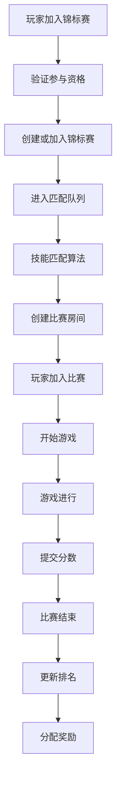

# 多人模式的单场比赛锦标赛匹配和创建机制

## 概述

多人模式的单场比赛锦标赛是一种特殊的锦标赛类型，它允许多个玩家在同一个锦标赛中参与，但每次比赛都是独立的单场比赛。这种模式结合了多人锦标赛的社交性和单人比赛的独立性。

## 系统架构

### 1. 核心组件

```
┌─────────────────────────────────────────────────────────────┐
│                多人单场比赛锦标赛系统                        │
├─────────────────────────────────────────────────────────────┤
│  Tournament Manager                                         │
│  ├── 锦标赛创建和管理                                        │
│  ├── 玩家加入和验证                                          │
│  └── 比赛分配策略                                            │
├─────────────────────────────────────────────────────────────┤
│  Match Manager                                              │
│  ├── 比赛创建 (createMatch)                                  │
│  ├── 玩家加入 (joinMatch)                                    │
│  ├── 技能匹配 (skillBasedMatching)                          │
│  └── 比赛结束 (endMatch)                                     │
├─────────────────────────────────────────────────────────────┤
│  Player Matching System                                     │
│  ├── 段位匹配 (Segment Matching)                            │
│  ├── ELO评分匹配 (ELO Rating)                               │
│  ├── 等待队列管理 (Queue Management)                        │
│  └── 匹配算法 (Matching Algorithm)                          │
├─────────────────────────────────────────────────────────────┤
│  Game Integration                                           │
│  ├── 本地游戏服务器                                          │
│  ├── 远程游戏服务器                                          │
│  └── 事件同步系统                                            │
└─────────────────────────────────────────────────────────────┘
```

### 2. 数据流



## 锦标赛配置

### 1. 多人单场比赛配置

```typescript
interface MultiPlayerSingleMatchConfig {
  rules: {
    allowReuse: true;                    // 允许复用锦标赛
    maxSubmissionsPerTournament: 3;      // 每个锦标赛最多提交3次
    dailyLimit: 5;                       // 每日限制5次
    maxTournamentsPerDay: 2;             // 每日最多参与2个锦标赛
    createInitialMatch: false;           // 不创建初始比赛
    minPlayers: 2;                       // 最小玩家数
    maxPlayers: 50;                      // 最大玩家数
    timeLimit: 60;                       // 时间限制60分钟
    skillBasedMatching: true;            // 启用技能匹配
    eloRange: 200;                       // ELO范围200分
    autoClose: true;                     // 自动关闭
    autoCloseDelay: 30;                  // 30分钟后自动关闭
  };
  entryFee: {
    coins: 100;
    tickets: [{ type: "normal", quantity: 1 }];
  };
  rewards: [
    { rankRange: [1, 1], coins: 500, gamePoints: 200 },
    { rankRange: [2, 3], coins: 250, gamePoints: 100 },
    { rankRange: [4, 10], coins: 100, gamePoints: 50 }
  ];
}
```

### 2. 匹配配置

```typescript
interface MatchingConfig {
  skillBasedMatching: boolean;           // 是否启用技能匹配
  eloRange: number;                      // ELO评分范围
  segmentMatching: boolean;              // 是否启用段位匹配
  maxWaitTime: number;                   // 最大等待时间（秒）
  minPlayersForMatch: number;            // 开始比赛的最小玩家数
  maxPlayersForMatch: number;            // 单场比赛的最大玩家数
  teamSize?: number;                     // 团队大小（团队模式）
  teamCount?: number;                    // 团队数量（团队模式）
}
```

## 匹配机制详解

### 1. 技能匹配算法

#### **段位匹配**
```typescript
// 段位匹配逻辑
async function segmentBasedMatching(ctx: any, player: any, tournamentId: string) {
  const playerSegment = player.segmentName; // "Bronze", "Silver", "Gold", "Platinum"
  
  // 查找同段位的等待玩家
  const waitingPlayers = await ctx.db
    .query("player_matches")
    .withIndex("by_tournament", (q) => q.eq("tournamentId", tournamentId))
    .filter((q) => q.eq(q.field("completed"), false))
    .collect();
    
  // 按段位分组
  const segmentGroups = new Map<string, any[]>();
  for (const waitingPlayer of waitingPlayers) {
    const playerInfo = await ctx.db
      .query("players")
      .withIndex("by_uid", (q) => q.eq("uid", waitingPlayer.uid))
      .first();
      
    if (playerInfo) {
      const segment = playerInfo.segmentName;
      if (!segmentGroups.has(segment)) {
        segmentGroups.set(segment, []);
      }
      segmentGroups.get(segment)!.push(waitingPlayer);
    }
  }
  
  // 优先匹配同段位
  const sameSegmentPlayers = segmentGroups.get(playerSegment) || [];
  if (sameSegmentPlayers.length >= 3) { // 需要至少3个玩家开始比赛
    return sameSegmentPlayers.slice(0, 4); // 返回4个玩家
  }
  
  // 如果同段位不够，扩展到相邻段位
  const adjacentSegments = getAdjacentSegments(playerSegment);
  for (const segment of adjacentSegments) {
    const players = segmentGroups.get(segment) || [];
    if (players.length > 0) {
      return [...sameSegmentPlayers, ...players].slice(0, 4);
    }
  }
  
  return null; // 没有合适的匹配
}
```

#### **ELO评分匹配**
```typescript
// ELO评分匹配逻辑
async function eloBasedMatching(ctx: any, player: any, tournamentId: string, eloRange: number) {
  const playerElo = player.eloScore || 1000; // 默认ELO评分1000
  
  // 查找ELO评分范围内的等待玩家
  const waitingPlayers = await ctx.db
    .query("player_matches")
    .withIndex("by_tournament", (q) => q.eq("tournamentId", tournamentId))
    .filter((q) => q.eq(q.field("completed"), false))
    .collect();
    
  const eligiblePlayers = [];
  for (const waitingPlayer of waitingPlayers) {
    const playerInfo = await ctx.db
      .query("players")
      .withIndex("by_uid", (q) => q.eq("uid", waitingPlayer.uid))
      .first();
      
    if (playerInfo) {
      const playerEloScore = playerInfo.eloScore || 1000;
      const eloDifference = Math.abs(playerElo - playerEloScore);
      
      if (eloDifference <= eloRange) {
        eligiblePlayers.push({
          ...waitingPlayer,
          eloScore: playerEloScore,
          eloDifference
        });
      }
    }
  }
  
  // 按ELO差异排序，优先匹配相近的
  eligiblePlayers.sort((a, b) => a.eloDifference - b.eloDifference);
  
  return eligiblePlayers.slice(0, 4); // 返回4个最匹配的玩家
}
```

### 2. 等待队列管理

#### **队列状态管理**
```typescript
// 等待队列管理
class MatchQueueManager {
  private queue: Map<string, QueueItem> = new Map();
  
  // 添加玩家到队列
  async addToQueue(ctx: any, player: any, tournamentId: string) {
    const queueItem: QueueItem = {
      uid: player.uid,
      tournamentId,
      joinTime: new Date().toISOString(),
      segment: player.segmentName,
      eloScore: player.eloScore || 1000,
      gameType: player.gameType,
      status: "waiting"
    };
    
    this.queue.set(player.uid, queueItem);
    
    // 尝试匹配
    await this.tryMatch(ctx, queueItem);
  }
  
  // 尝试匹配
  async tryMatch(ctx: any, queueItem: QueueItem) {
    const eligiblePlayers = await this.findEligiblePlayers(ctx, queueItem);
    
    if (eligiblePlayers.length >= 4) { // 需要4个玩家开始比赛
      await this.createMatch(ctx, eligiblePlayers);
    }
  }
  
  // 查找符合条件的玩家
  async findEligiblePlayers(ctx: any, queueItem: QueueItem) {
    const eligiblePlayers = [];
    
    for (const [uid, item] of this.queue) {
      if (uid === queueItem.uid) continue;
      if (item.tournamentId !== queueItem.tournamentId) continue;
      if (item.status !== "waiting") continue;
      
      // 检查段位匹配
      if (this.isSegmentCompatible(queueItem.segment, item.segment)) {
        eligiblePlayers.push(item);
      }
    }
    
    return eligiblePlayers;
  }
  
  // 创建比赛
  async createMatch(ctx: any, players: QueueItem[]) {
    const matchId = await MatchManager.createMatch(ctx, {
      tournamentId: players[0].tournamentId,
      gameType: players[0].gameType,
      matchType: "multi_player",
      maxPlayers: 4,
      minPlayers: 4,
      gameData: {
        roomType: "competitive",
        skillBasedMatching: true,
        eloRange: 200
      }
    });
    
    // 将玩家加入比赛
    for (const player of players) {
      await MatchManager.joinMatch(ctx, {
        matchId,
        tournamentId: player.tournamentId,
        uid: player.uid,
        gameType: player.gameType
      });
      
      // 从队列中移除
      this.queue.delete(player.uid);
    }
  }
}
```

## 比赛创建流程

### 1. 锦标赛加入流程

```typescript
// 多人单场比赛锦标赛加入流程
async function joinMultiPlayerSingleMatchTournament(ctx: any, params: {
  uid: string;
  gameType: string;
  tournamentType: string;
  player: any;
  season: any;
}) {
  const now = getTorontoDate();
  
  // 1. 验证参与限制
  await validateParticipationLimits(ctx, params.uid, params.tournamentType);
  
  // 2. 查找或创建锦标赛
  let tournamentId;
  const existingTournament = await ctx.db
    .query("tournaments")
    .filter((q) => 
      q.and(
        q.eq(q.field("tournamentType"), params.tournamentType),
        q.eq(q.field("gameType"), params.gameType),
        q.eq(q.field("status"), "open")
      )
    )
    .first();
    
  if (existingTournament) {
    tournamentId = existingTournament._id;
    
    // 检查玩家是否已在该锦标赛中
    if (!existingTournament.playerUids.includes(params.uid)) {
      await ctx.db.patch(tournamentId, {
        playerUids: [...existingTournament.playerUids, params.uid]
      });
    }
  } else {
    // 创建新锦标赛
    tournamentId = await ctx.db.insert("tournaments", {
      seasonId: params.season._id,
      gameType: params.gameType,
      segmentName: params.player.segmentName,
      status: "open",
      playerUids: [params.uid],
      tournamentType: params.tournamentType,
      isSubscribedRequired: false,
      isSingleMatch: false, // 多人模式
      prizePool: 100,
      config: {
        rules: {
          allowReuse: true,
          maxSubmissionsPerTournament: 3,
          skillBasedMatching: true,
          eloRange: 200,
          minPlayers: 2,
          maxPlayers: 50
        }
      },
      createdAt: now.iso,
      updatedAt: now.iso,
      endTime: new Date(now.localDate.getTime() + 24 * 60 * 60 * 1000).toISOString()
    });
  }
  
  // 3. 加入匹配队列
  await addToMatchQueue(ctx, {
    uid: params.uid,
    tournamentId,
    player: params.player,
    gameType: params.gameType
  });
  
  return { tournamentId, status: "queued" };
}
```

### 2. 匹配和比赛创建

```typescript
// 匹配和比赛创建流程
async function matchAndCreateGame(ctx: any, params: {
  uid: string;
  tournamentId: string;
  player: any;
  gameType: string;
}) {
  const now = getTorontoDate();
  
  // 1. 查找匹配的玩家
  const matchedPlayers = await findMatchedPlayers(ctx, {
    uid: params.uid,
    tournamentId: params.tournamentId,
    player: params.player,
    gameType: params.gameType
  });
  
  if (!matchedPlayers || matchedPlayers.length < 4) {
    // 没有足够的匹配玩家，继续等待
    return { status: "waiting", message: "等待其他玩家加入..." };
  }
  
  // 2. 创建比赛
  const matchId = await MatchManager.createMatch(ctx, {
    tournamentId: params.tournamentId,
    gameType: params.gameType,
    matchType: "multi_player",
    maxPlayers: 4,
    minPlayers: 4,
    gameData: {
      roomType: "competitive",
      skillBasedMatching: true,
      eloRange: 200,
      matchedPlayers: matchedPlayers.map(p => ({
        uid: p.uid,
        segment: p.segment,
        eloScore: p.eloScore
      }))
    }
  });
  
  // 3. 将所有匹配的玩家加入比赛
  for (const matchedPlayer of matchedPlayers) {
    await MatchManager.joinMatch(ctx, {
      matchId,
      tournamentId: params.tournamentId,
      uid: matchedPlayer.uid,
      gameType: params.gameType
    });
  }
  
  // 4. 创建游戏
  const gameResult = await createGame(ctx, {
    matchId,
    uids: matchedPlayers.map(p => p.uid),
    gameType: params.gameType
  });
  
  return {
    status: "matched",
    matchId,
    gameId: gameResult.gameId,
    players: matchedPlayers.map(p => ({
      uid: p.uid,
      segment: p.segment,
      eloScore: p.eloScore
    }))
  };
}
```

### 3. 游戏创建

```typescript
// 创建游戏
async function createGame(ctx: any, params: {
  matchId: string;
  uids: string[];
  gameType: string;
}) {
  // 根据游戏类型选择创建方式
  if (isLocalGame(params.gameType)) {
    return await createLocalGame(ctx, params);
  } else {
    return await createRemoteGame(ctx, params);
  }
}

// 创建本地游戏
async function createLocalGame(ctx: any, params: {
  matchId: string;
  uids: string[];
  gameType: string;
}) {
  const gameService = new GameManager(ctx);
  const gameId = await gameService.createGame(params.uids, params.matchId);
  
  // 记录游戏创建事件
  await ctx.db.insert("match_events", {
    matchId: params.matchId,
    eventType: "game_created",
    eventData: {
      gameId,
      uids: params.uids,
      gameType: params.gameType
    },
    timestamp: new Date().toISOString(),
    createdAt: new Date().toISOString()
  });
  
  return { gameId, type: "local" };
}

// 创建远程游戏
async function createRemoteGame(ctx: any, params: {
  matchId: string;
  uids: string[];
  gameType: string;
}) {
  const gameResponse = await fetch(gameAPI, {
    method: "POST",
    headers: {
      "Content-Type": "application/json",
    },
    body: JSON.stringify({
      uids: params.uids,
      matchId: params.matchId,
      gameType: params.gameType
    })
  });
  
  const gameResult = await gameResponse.json();
  
  // 发送事件通知给所有玩家
  const events = params.uids.map(uid => ({
    name: "GameCreated",
    uid,
    data: {
      gameId: gameResult.gameId,
      matchId: params.matchId,
      gameType: params.gameType
    }
  }));
  
  await fetch(eventAPI, {
    method: "POST",
    headers: {
      "Authorization": `Bearer ${apiToken}`,
      "Content-Type": "application/json",
    },
    body: JSON.stringify(events)
  });
  
  return { gameId: gameResult.gameId, type: "remote" };
}
```

## 事件流管理

### 1. 事件类型

```typescript
// 多人单场比赛事件类型
interface MultiPlayerSingleMatchEvents {
  // 匹配事件
  player_queued: {
    uid: string;
    tournamentId: string;
    segment: string;
    eloScore: number;
    joinTime: string;
  };
  
  // 匹配成功事件
  players_matched: {
    matchId: string;
    tournamentId: string;
    players: Array<{
      uid: string;
      segment: string;
      eloScore: number;
    }>;
    matchTime: string;
  };
  
  // 比赛事件
  match_created: {
    matchId: string;
    tournamentId: string;
    matchType: string;
    maxPlayers: number;
    minPlayers: number;
  };
  
  // 游戏事件
  game_created: {
    matchId: string;
    gameId: string;
    uids: string[];
    gameType: string;
  };
  
  // 比赛结束事件
  match_completed: {
    matchId: string;
    tournamentId: string;
    rankings: Array<{
      uid: string;
      score: number;
      rank: number;
    }>;
    completionTime: string;
  };
}
```

### 2. 事件处理流程

```typescript
// 事件处理流程
async function handleMultiPlayerSingleMatchEvent(ctx: any, event: any) {
  // 1. 记录事件
  await ctx.db.insert("match_events", {
    matchId: event.matchId,
    tournamentId: event.tournamentId,
    uid: event.uid,
    eventType: event.name,
    eventData: event.data,
    timestamp: new Date().toISOString(),
    createdAt: new Date().toISOString()
  });
  
  // 2. 根据事件类型执行相应逻辑
  switch (event.name) {
    case "player_queued":
      await handlePlayerQueued(ctx, event);
      break;
    case "players_matched":
      await handlePlayersMatched(ctx, event);
      break;
    case "match_created":
      await handleMatchCreated(ctx, event);
      break;
    case "game_created":
      await handleGameCreated(ctx, event);
      break;
    case "match_completed":
      await handleMatchCompleted(ctx, event);
      break;
  }
}
```

## 性能优化

### 1. 匹配算法优化

```typescript
// 优化的匹配算法
class OptimizedMatchingAlgorithm {
  private playerPool: Map<string, PlayerInfo> = new Map();
  private matchQueue: PriorityQueue<MatchRequest> = new PriorityQueue();
  
  // 添加玩家到匹配池
  addPlayer(player: PlayerInfo) {
    this.playerPool.set(player.uid, player);
    this.tryMatch(player);
  }
  
  // 尝试匹配
  tryMatch(player: PlayerInfo) {
    const candidates = this.findCandidates(player);
    
    if (candidates.length >= 3) {
      const match = this.createMatch([player, ...candidates.slice(0, 3)]);
      this.removePlayersFromPool(match.players);
      return match;
    }
    
    return null;
  }
  
  // 查找候选玩家
  findCandidates(player: PlayerInfo) {
    const candidates = [];
    
    for (const [uid, candidate] of this.playerPool) {
      if (uid === player.uid) continue;
      
      if (this.isCompatible(player, candidate)) {
        candidates.push({
          ...candidate,
          compatibilityScore: this.calculateCompatibility(player, candidate)
        });
      }
    }
    
    // 按兼容性评分排序
    candidates.sort((a, b) => b.compatibilityScore - a.compatibilityScore);
    
    return candidates;
  }
  
  // 计算兼容性评分
  calculateCompatibility(player1: PlayerInfo, player2: PlayerInfo) {
    let score = 100;
    
    // 段位差异扣分
    const segmentDiff = Math.abs(this.getSegmentTier(player1.segment) - this.getSegmentTier(player2.segment));
    score -= segmentDiff * 20;
    
    // ELO差异扣分
    const eloDiff = Math.abs(player1.eloScore - player2.eloScore);
    score -= Math.min(eloDiff / 10, 50);
    
    // 等待时间加分
    const waitTime = Date.now() - player2.joinTime;
    score += Math.min(waitTime / 1000, 30);
    
    return Math.max(score, 0);
  }
}
```

### 2. 缓存策略

```typescript
// 匹配缓存策略
class MatchingCache {
  private cache: Map<string, any> = new Map();
  private ttl: number = 30000; // 30秒TTL
  
  // 缓存玩家信息
  cachePlayerInfo(uid: string, info: any) {
    this.cache.set(uid, {
      data: info,
      timestamp: Date.now()
    });
  }
  
  // 获取玩家信息
  getPlayerInfo(uid: string) {
    const cached = this.cache.get(uid);
    if (!cached) return null;
    
    if (Date.now() - cached.timestamp > this.ttl) {
      this.cache.delete(uid);
      return null;
    }
    
    return cached.data;
  }
  
  // 清理过期缓存
  cleanup() {
    const now = Date.now();
    for (const [key, value] of this.cache) {
      if (now - value.timestamp > this.ttl) {
        this.cache.delete(key);
      }
    }
  }
}
```

## 错误处理和监控

### 1. 匹配超时处理

```typescript
// 匹配超时处理
async function handleMatchingTimeout(ctx: any, player: any) {
  const waitTime = Date.now() - player.joinTime;
  const maxWaitTime = 60000; // 60秒最大等待时间
  
  if (waitTime > maxWaitTime) {
    // 创建AI对手或放宽匹配条件
    const aiPlayers = await createAIOpponents(ctx, player);
    
    const matchId = await MatchManager.createMatch(ctx, {
      tournamentId: player.tournamentId,
      gameType: player.gameType,
      matchType: "multi_player",
      maxPlayers: 4,
      minPlayers: 2,
      gameData: {
        roomType: "ai_fallback",
        aiPlayers: aiPlayers.length
      }
    });
    
    // 将玩家和AI加入比赛
    await MatchManager.joinMatch(ctx, {
      matchId,
      tournamentId: player.tournamentId,
      uid: player.uid,
      gameType: player.gameType
    });
    
    for (const aiPlayer of aiPlayers) {
      await MatchManager.joinMatch(ctx, {
        matchId,
        tournamentId: player.tournamentId,
        uid: aiPlayer.uid,
        gameType: player.gameType
      });
    }
    
    return { matchId, status: "ai_fallback" };
  }
  
  return null;
}
```

### 2. 性能监控

```typescript
// 性能监控
class MatchingPerformanceMonitor {
  private metrics = {
    averageWaitTime: 0,
    matchSuccessRate: 0,
    totalMatches: 0,
    failedMatches: 0
  };
  
  // 记录匹配时间
  recordMatchTime(waitTime: number) {
    this.metrics.averageWaitTime = 
      (this.metrics.averageWaitTime * this.metrics.totalMatches + waitTime) / 
      (this.metrics.totalMatches + 1);
  }
  
  // 记录匹配成功
  recordMatchSuccess() {
    this.metrics.totalMatches++;
    this.metrics.matchSuccessRate = 
      (this.metrics.totalMatches - this.metrics.failedMatches) / this.metrics.totalMatches;
  }
  
  // 记录匹配失败
  recordMatchFailure() {
    this.metrics.totalMatches++;
    this.metrics.failedMatches++;
    this.metrics.matchSuccessRate = 
      (this.metrics.totalMatches - this.metrics.failedMatches) / this.metrics.totalMatches;
  }
  
  // 获取性能报告
  getPerformanceReport() {
    return {
      ...this.metrics,
      timestamp: new Date().toISOString()
    };
  }
}
```

## 总结

多人模式的单场比赛锦标赛匹配和创建机制提供了：

1. **智能匹配**: 基于段位和ELO评分的技能匹配
2. **队列管理**: 高效的等待队列和匹配算法
3. **灵活配置**: 支持多种匹配策略和参数调整
4. **性能优化**: 缓存策略和算法优化
5. **错误处理**: 超时处理和AI回退机制
6. **监控系统**: 实时性能监控和报告

这种设计确保了玩家能够快速找到合适的对手，同时保持了比赛的公平性和竞技性。 