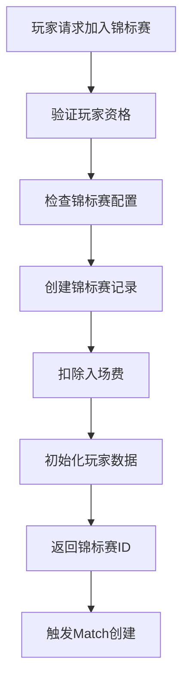
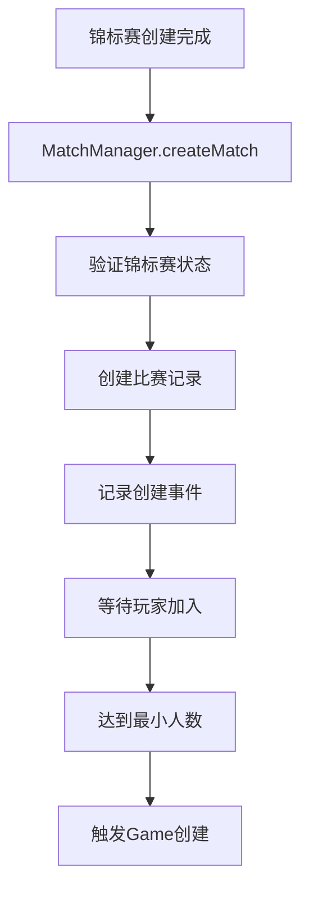
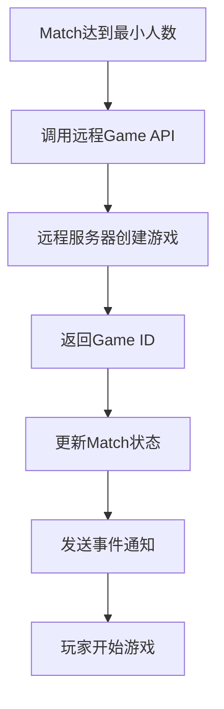
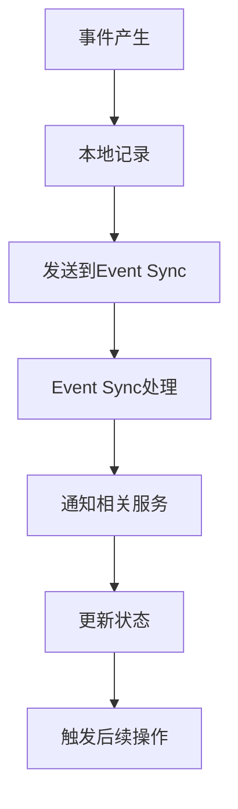

# 远程游戏服务器架构下的 Tournament-Match-Game 创建流程

## 概述

当游戏服务器是远程部署时，系统采用分布式架构，通过 API 接口和事件同步机制来实现 tournament、match、game 三者的协调创建和管理。

## 系统架构

### 1. 组件分布

```
┌─────────────────┐    ┌─────────────────┐    ┌─────────────────┐
│   Tournament    │    │     Match       │    │   Remote Game   │
│   Server        │    │   Manager       │    │    Server       │
│  (Convex)       │    │   (Convex)      │    │  (External)     │
└─────────────────┘    └─────────────────┘    └─────────────────┘
         │                       │                       │
         │                       │                       │
         └───────────────────────┼───────────────────────┘
                                 │
                    ┌─────────────────┐
                    │   Event Sync    │
                    │   Service       │
                    │  (Convex)       │
                    └─────────────────┘
```

### 2. 服务职责

#### **Tournament Server (Convex)**
- 管理锦标赛生命周期
- 处理玩家加入/退出
- 分配奖励和积分
- 维护赛季数据

#### **Match Manager (Convex)**
- 创建和管理比赛记录
- 处理玩家匹配
- 记录比赛事件
- 协调游戏创建

#### **Remote Game Server (External)**
- 执行具体游戏逻辑
- 管理游戏状态
- 处理玩家操作
- 返回游戏结果

#### **Event Sync Service (Convex)**
- 同步事件数据
- 处理跨服务通信
- 维护数据一致性

## 创建流程详解

### 1. Tournament 创建流程



#### **代码实现**
```typescript
// 在 baseHandler.join 中
async join(ctx, { uid, gameType, tournamentType, player, season }) {
  const now = getTorontoDate();
  
  // 1. 验证和创建锦标赛
  const tournamentId = await createTournament(ctx, {
    uid, gameType, tournamentType, player, season, config, now
  });
  
  // 2. 创建初始比赛记录
  if (config.rules?.createInitialMatch !== false) {
    await ctx.db.insert("matches", {
      tournamentId,
      gameType,
      uid,
      score: 0,
      completed: false,
      attemptNumber,
      propsUsed: [],
      gameData: {},
      createdAt: now.iso,
      updatedAt: now.iso,
    });
  }
  
  return { tournamentId, attemptNumber };
}
```

### 2. Match 创建流程



#### **代码实现**
```typescript
// 在 MatchManager.createMatch 中
static async createMatch(ctx: any, params: {
  tournamentId: string;
  gameType: string;
  matchType: string;
  maxPlayers: number;
  minPlayers: number;
  gameData?: any;
}) {
  const now = getTorontoDate();
  
  // 1. 创建比赛记录
  const matchId = await ctx.db.insert("matches", {
    tournamentId: params.tournamentId,
    gameType: params.gameType,
    matchType: params.matchType,
    status: "pending",
    maxPlayers: params.maxPlayers,
    minPlayers: params.minPlayers,
    startTime: undefined,
    endTime: undefined,
    gameData: params.gameData || {},
    createdAt: now.iso,
    updatedAt: now.iso,
  });
  
  // 2. 记录创建事件
  await ctx.db.insert("match_events", {
    matchId,
    tournamentId: params.tournamentId,
    eventType: "match_created",
    eventData: {
      matchType: params.matchType,
      maxPlayers: params.maxPlayers,
      minPlayers: params.minPlayers,
    },
    timestamp: now.iso,
    createdAt: now.iso,
  });
  
  return matchId;
}
```

### 3. Game 创建流程



#### **代码实现**
```typescript
// 在 joinMatch 中，当达到最小人数时
if (currentPlayers.length + 1 >= match.minPlayers) {
  // 1. 更新比赛状态
  await ctx.db.patch(params.matchId, {
    status: "in_progress",
    startTime: now.iso,
    updatedAt: now.iso,
  });
  
  // 2. 调用远程游戏服务器
  const gameResponse = await fetch(gameAPI, {
    method: "POST",
    headers: {
      "Content-Type": "application/json",
    },
    body: JSON.stringify({
      uids: currentPlayers.map(p => p.uid),
      matchId: params.matchId,
      gameType: params.gameType
    })
  });
  
  const gameResult = await gameResponse.json();
  
  // 3. 发送事件通知
  const events = currentPlayers.map(player => ({
    name: "GameCreated",
    uid: player.uid,
    data: {
      gameId: gameResult.gameId,
      matchId: params.matchId,
      gameType: params.gameType
    }
  }));
  
  await fetch(eventAPI, {
    method: "POST",
    headers: {
      "Authorization": `Bearer ${apiToken}`,
      "Content-Type": "application/json",
    },
    body: JSON.stringify(events)
  });
}
```

## API 接口设计

### 1. 游戏创建 API

#### **请求格式**
```typescript
POST /game/create
Content-Type: application/json

{
  "uids": ["player1", "player2"],
  "matchId": "match_123",
  "gameType": "solitaire",
  "config": {
    "rules": "standard",
    "timeLimit": 300
  }
}
```

#### **响应格式**
```typescript
{
  "ok": true,
  "gameId": "game_456",
  "status": "created",
  "seats": [
    { "field": 1, "uid": "player1" },
    { "field": 2, "uid": "player2" }
  ]
}
```

### 2. 事件同步 API

#### **请求格式**
```typescript
POST /event/sync
Authorization: Bearer 1234567890
Content-Type: application/json

[
  {
    "name": "GameCreated",
    "uid": "player1",
    "data": {
      "gameId": "game_456",
      "matchId": "match_123"
    }
  }
]
```

#### **响应格式**
```typescript
{
  "ok": true,
  "synced": 1,
  "errors": []
}
```

## 事件流机制

### 1. 事件类型

#### **Tournament 事件**
```typescript
// 锦标赛创建
{
  name: "TournamentCreated",
  data: { tournamentId, gameType, playerCount }
}

// 锦标赛结算
{
  name: "TournamentSettled",
  data: { tournamentId, rankings, rewards }
}
```

#### **Match 事件**
```typescript
// 比赛创建
{
  name: "MatchCreated",
  data: { matchId, tournamentId, matchType }
}

// 玩家加入
{
  name: "PlayerJoined",
  data: { matchId, uid, playerCount }
}

// 比赛开始
{
  name: "MatchStarted",
  data: { matchId, gameId, playerCount }
}
```

#### **Game 事件**
```typescript
// 游戏创建
{
  name: "GameCreated",
  data: { gameId, matchId, gameType }
}

// 游戏开始
{
  name: "GameStarted",
  data: { gameId, status: 1 }
}

// 游戏结束
{
  name: "GameEnded",
  data: { gameId, results, scores }
}
```

### 2. 事件处理流程



## 数据一致性保证

### 1. 状态同步策略

#### **乐观锁机制**
```typescript
// 在更新比赛状态时
const match = await ctx.db.get(matchId);
if (match.status !== "pending") {
  throw new Error("比赛状态已改变");
}

await ctx.db.patch(matchId, {
  status: "in_progress",
  version: match.version + 1
});
```

#### **事件溯源**
```typescript
// 记录所有状态变化
await ctx.db.insert("match_events", {
  matchId,
  eventType: "status_changed",
  eventData: {
    from: "pending",
    to: "in_progress",
    reason: "min_players_reached"
  },
  timestamp: now.iso
});
```

### 2. 错误处理和恢复

#### **重试机制**
```typescript
async function createGameWithRetry(params: any, maxRetries = 3) {
  for (let i = 0; i < maxRetries; i++) {
    try {
      const response = await fetch(gameAPI, {
        method: "POST",
        headers: { "Content-Type": "application/json" },
        body: JSON.stringify(params)
      });
      
      if (response.ok) {
        return await response.json();
      }
    } catch (error) {
      console.error(`Game creation attempt ${i + 1} failed:`, error);
      if (i === maxRetries - 1) throw error;
      await new Promise(resolve => setTimeout(resolve, 1000 * (i + 1)));
    }
  }
}
```

#### **回滚机制**
```typescript
async function rollbackMatchCreation(matchId: string) {
  // 1. 取消比赛
  await ctx.db.patch(matchId, {
    status: "cancelled",
    updatedAt: now.iso
  });
  
  // 2. 退还入场费
  const match = await ctx.db.get(matchId);
  if (match) {
    await refundEntryFee(match.tournamentId, match.uid);
  }
  
  // 3. 记录回滚事件
  await ctx.db.insert("match_events", {
    matchId,
    eventType: "match_cancelled",
    eventData: { reason: "game_creation_failed" },
    timestamp: now.iso
  });
}
```

## 性能优化

### 1. 异步处理

#### **非阻塞操作**
```typescript
// 异步创建游戏，不阻塞比赛流程
await ctx.scheduler.runAfter(0, internal.service.gameProxy.createGame, {
  matchId: params.matchId,
  uids: currentPlayers.map(p => p.uid),
  gameType: params.gameType
});
```

#### **批量事件处理**
```typescript
// 批量发送事件
const events = [];
for (const player of players) {
  events.push({
    name: "GameCreated",
    uid: player.uid,
    data: { gameId, matchId }
  });
}

await fetch(eventAPI, {
  method: "POST",
  headers: { "Content-Type": "application/json" },
  body: JSON.stringify(events)
});
```

### 2. 缓存策略

#### **本地缓存**
```typescript
// 缓存锦标赛配置
const tournamentConfig = await getCachedTournamentConfig(tournamentType);
if (!tournamentConfig) {
  const config = await loadTournamentConfig(tournamentType);
  await cacheTournamentConfig(tournamentType, config);
}
```

#### **连接池管理**
```typescript
// 复用HTTP连接
const gameServerClient = new GameServerClient({
  baseURL: gameAPI,
  timeout: 5000,
  pool: { max: 10, min: 2 }
});
```

## 监控和调试

### 1. 日志记录

#### **结构化日志**
```typescript
await ctx.db.insert("system_logs", {
  level: "info",
  component: "match_creation",
  action: "create_game",
  data: {
    matchId: params.matchId,
    gameType: params.gameType,
    playerCount: currentPlayers.length,
    timestamp: now.iso
  },
  createdAt: now.iso
});
```

#### **性能监控**
```typescript
const startTime = Date.now();
const result = await createGame(params);
const duration = Date.now() - startTime;

await ctx.db.insert("performance_logs", {
  operation: "game_creation",
  duration,
  success: !!result,
  createdAt: now.iso
});
```

### 2. 健康检查

#### **服务状态检查**
```typescript
async function checkGameServerHealth() {
  try {
    const response = await fetch(`${gameAPI}/health`);
    return response.ok;
  } catch (error) {
    console.error("Game server health check failed:", error);
    return false;
  }
}
```

#### **依赖服务监控**
```typescript
async function monitorDependencies() {
  const checks = [
    checkGameServerHealth(),
    checkEventSyncHealth(),
    checkDatabaseHealth()
  ];
  
  const results = await Promise.allSettled(checks);
  return results.map((result, index) => ({
    service: ['game', 'event', 'db'][index],
    healthy: result.status === 'fulfilled' && result.value
  }));
}
```

## 总结

远程游戏服务器架构下的 Tournament-Match-Game 创建流程是一个复杂的分布式系统，需要：

1. **清晰的职责分离**：每个服务专注于自己的核心功能
2. **可靠的事件机制**：确保跨服务通信的可靠性
3. **完善的状态管理**：维护数据一致性
4. **健壮的错误处理**：处理网络故障和服务异常
5. **性能优化**：通过异步处理和缓存提升响应速度
6. **全面监控**：实时监控系统状态和性能指标

这种架构能够支持大规模的游戏服务，同时保持系统的可扩展性和可维护性。 