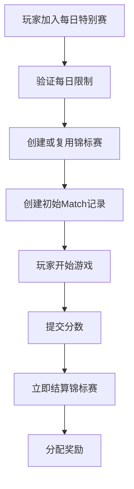
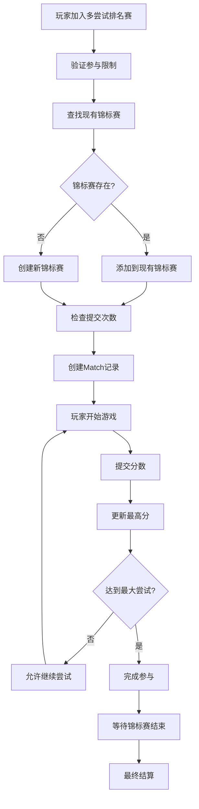
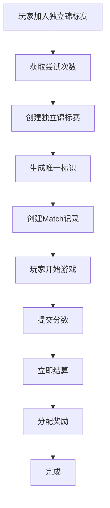
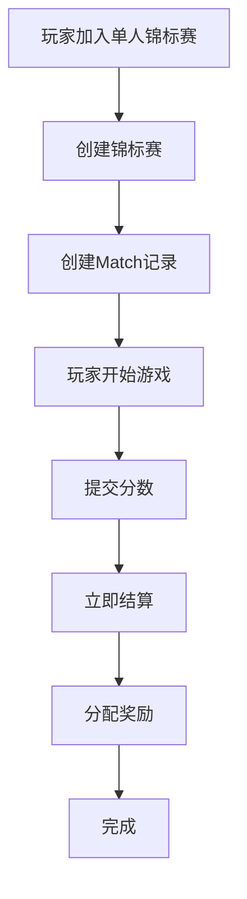

# 同项目架构下的 Tournament 类型与 Match/Game 创建流程

## 概述

当 tournament 和 match 在同一个 Convex project 中时，系统采用基于类型的处理器模式，为不同的锦标赛类型提供定制化的 match 和 game 创建流程。

## 系统架构

### 1. 组件结构

```
┌─────────────────────────────────────────────────────────────┐
│                    Tournament System                        │
│  (Single Convex Project)                                    │
├─────────────────────────────────────────────────────────────┤
│  Tournament Types                                           │
│  ├── daily_special (每日特别赛)                              │
│  ├── multi_attempt_ranked (多尝试排名赛)                     │
│  ├── independent_tournament (独立锦标赛)                     │
│  ├── single_player_tournament (单人锦标赛)                   │
│  └── practice_tournament (练习锦标赛)                        │
├─────────────────────────────────────────────────────────────┤
│  Tournament Handlers                                        │
│  ├── baseHandler (基础处理器)                                │
│  ├── dailySpecialHandler (每日特别赛处理器)                  │
│  ├── multiAttemptRankedHandler (多尝试排名赛处理器)          │
│  ├── independentTournamentHandler (独立锦标赛处理器)          │
│  └── singlePlayerTournamentHandler (单人锦标赛处理器)        │
├─────────────────────────────────────────────────────────────┤
│  Match Manager                                              │
│  ├── createMatch (创建比赛)                                  │
│  ├── joinMatch (加入比赛)                                    │
│  ├── submitScore (提交分数)                                  │
│  └── endMatch (结束比赛)                                     │
├─────────────────────────────────────────────────────────────┤
│  Game Integration                                           │
│  ├── Local Game Server (本地游戏服务器)                      │
│  ├── Remote Game Server (远程游戏服务器)                     │
│  └── Event Sync (事件同步)                                   │
└─────────────────────────────────────────────────────────────┘
```

### 2. 处理器注册机制

```typescript
// 在 handler/index.ts 中注册不同类型的处理器
const handlers: Record<string, TournamentHandler> = {
  daily_special: dailySpecialHandler,
  multi_attempt_ranked: multiAttemptRankedHandler,
  independent_tournament: independentTournamentHandler,
  single_player_tournament: singlePlayerTournamentHandler,
};

export function getHandler(tournamentType: string): TournamentHandler {
  const handler = handlers[tournamentType];
  if (!handler) throw new Error(`未知锦标赛类型: ${tournamentType}`);
  return handler;
}
```

## 锦标赛类型详解

### 1. 每日特别赛 (daily_special)

#### **特点**
- 每日限时特殊锦标赛
- 单局模式，立即结算
- 支持多次尝试
- 基于分数阈值的排名

#### **配置**
```typescript
{
  typeId: "daily_special",
  name: "每日特别赛",
  description: "每日多次单局",
  defaultConfig: {
    rules: {
      maxAttempts: 3,
      isSingleMatch: true,
      ranking: "threshold",
      scoreThreshold: 1000
    },
    entryFee: {
      coins: 20,
      ticket: {
        gameType: "solitaire",
        tournamentType: "daily_special",
        quantity: 1
      }
    },
    rewards: [
      {
        rankRange: [1, 1],
        coins: 300,
        props: [{ propType: "hint", quantity: 2 }],
        gamePoints: 100
      }
    ],
    duration: 0, // 立即结算
    subscriberBonus: {
      coins: 1.0,
      gamePoints: 1.5
    }
  }
}
```

#### **创建流程**


#### **代码实现**
```typescript
// 在 dailySpecialHandler 中
async join(ctx, { uid, gameType, tournamentType, player, season }) {
  const now = getTorontoDate();
  const today = now.localDate.toISOString().split("T")[0];
  
  // 1. 检查每日参与限制
  const todayParticipations = await ctx.db
    .query("player_tournament_participation")
    .withIndex("by_uid_date", (q) => 
      q.eq("uid", uid).eq("participationDate", today)
    )
    .filter((q) => q.eq(q.field("tournamentType"), tournamentType))
    .collect();
    
  const maxParticipations = 3; // 每日最多3次
  if (todayParticipations.length >= maxParticipations) {
    throw new Error("今日参与次数已达上限");
  }
  
  // 2. 查找或创建锦标赛
  let tournamentId;
  const existingTournament = await ctx.db
    .query("tournaments")
    .filter((q) => 
      q.and(
        q.eq(q.field("tournamentType"), tournamentType),
        q.eq(q.field("gameType"), gameType),
        q.eq(q.field("status"), "open")
      )
    )
    .first();
    
  if (existingTournament) {
    tournamentId = existingTournament._id;
    // 添加玩家到现有锦标赛
    if (!existingTournament.playerUids.includes(uid)) {
      await ctx.db.patch(tournamentId, {
        playerUids: [...existingTournament.playerUids, uid]
      });
    }
  } else {
    // 创建新锦标赛
    tournamentId = await ctx.db.insert("tournaments", {
      seasonId: season._id,
      gameType,
      segmentName: player.segmentName,
      status: "open",
      playerUids: [uid],
      tournamentType,
      isSubscribedRequired: false,
      isSingleMatch: true,
      prizePool: 100,
      config: {
        entryFee: { coins: 20 },
        rules: {
          maxAttempts: 3,
          isSingleMatch: true,
          ranking: "threshold",
          scoreThreshold: 1000
        },
        rewards: [
          { rankRange: [1, 1], coins: 300, gamePoints: 100 }
        ]
      },
      createdAt: now.iso,
      updatedAt: now.iso,
      endTime: new Date(now.localDate.getTime() + 24 * 60 * 60 * 1000).toISOString()
    });
  }
  
  // 3. 创建初始Match记录
  await ctx.db.insert("matches", {
    tournamentId,
    gameType,
    uid,
    score: 0,
    completed: false,
    attemptNumber: 1,
    propsUsed: [],
    gameData: {},
    createdAt: now.iso,
    updatedAt: now.iso,
  });
  
  return { tournamentId, attemptNumber: 1 };
}
```

### 2. 多尝试排名赛 (multi_attempt_ranked)

#### **特点**
- 支持多次尝试
- 取最高分排名
- 长期运行
- 多人共享锦标赛

#### **配置**
```typescript
{
  typeId: "multi_attempt_ranked",
  name: "多尝试排名赛",
  description: "支持多次尝试的排名锦标赛",
  defaultConfig: {
    rules: {
      maxAttempts: 5,
      allowReuse: true,
      maxSubmissionsPerTournament: 5,
      ranking: "highest_score",
      timeLimit: 120
    },
    entryFee: {
      coins: 100,
      ticket: {
        gameType: "solitaire",
        tournamentType: "multi_attempt_ranked",
        quantity: 1
      }
    },
    rewards: [
      {
        rankRange: [1, 1],
        coins: 1000,
        gamePoints: 500,
        props: [
          { propType: "hint", quantity: 5 },
          { propType: "undo", quantity: 3 }
        ]
      }
    ],
    duration: 168, // 7天
    subscriberBonus: {
      coins: 1.3,
      gamePoints: 1.6
    }
  }
}
```

#### **创建流程**


#### **代码实现**
```typescript
// 在 multiAttemptRankedHandler 中
async join(ctx, { uid, gameType, tournamentType, player, season }) {
  const now = getTorontoDate();
  
  // 1. 验证参与限制
  const config = await getTournamentConfig(tournamentType);
  await validateParticipationLimits(ctx, uid, tournamentType, config);
  
  // 2. 查找或创建锦标赛
  let tournamentId;
  const existingTournament = await ctx.db
    .query("tournaments")
    .filter((q) => 
      q.and(
        q.eq(q.field("tournamentType"), tournamentType),
        q.eq(q.field("gameType"), gameType),
        q.eq(q.field("status"), "open")
      )
    )
    .first();
    
  if (existingTournament) {
    tournamentId = existingTournament._id;
    
    // 检查玩家是否已在该锦标赛中
    if (!existingTournament.playerUids.includes(uid)) {
      await ctx.db.patch(tournamentId, {
        playerUids: [...existingTournament.playerUids, uid]
      });
    }
    
    // 检查提交次数限制
    const playerMatches = await ctx.db
      .query("matches")
      .withIndex("by_tournament_uid", (q) => 
        q.eq("tournamentId", tournamentId).eq("uid", uid)
      )
      .filter((q) => q.eq(q.field("completed"), true))
      .collect();
      
    const maxSubmissions = config.rules.maxSubmissionsPerTournament;
    if (maxSubmissions > 0 && playerMatches.length >= maxSubmissions) {
      throw new Error(`在该锦标赛中最多只能提交${maxSubmissions}次分数`);
    }
  } else {
    // 创建新锦标赛
    tournamentId = await ctx.db.insert("tournaments", {
      seasonId: season._id,
      gameType,
      segmentName: player.segmentName,
      status: "open",
      playerUids: [uid],
      tournamentType,
      isSubscribedRequired: false,
      isSingleMatch: false,
      prizePool: config.entryFee.coins * 0.8,
      config,
      createdAt: now.iso,
      updatedAt: now.iso,
      endTime: new Date(now.localDate.getTime() + config.duration * 60 * 60 * 1000).toISOString()
    });
  }
  
  // 3. 创建Match记录
  const attemptNumber = await getNextAttemptNumber(ctx, tournamentId, uid);
  await ctx.db.insert("matches", {
    tournamentId,
    gameType,
    uid,
    score: 0,
    completed: false,
    attemptNumber,
    propsUsed: [],
    gameData: {},
    createdAt: now.iso,
    updatedAt: now.iso,
  });
  
  return { tournamentId, attemptNumber };
}
```

### 3. 独立锦标赛 (independent_tournament)

#### **特点**
- 每次尝试创建独立锦标赛
- 单人模式
- 立即结算
- 适合练习和测试

#### **配置**
```typescript
{
  typeId: "independent_tournament",
  name: "独立锦标赛",
  description: "每次尝试创建独立锦标赛",
  defaultConfig: {
    rules: {
      independentAttempts: true,
      maxAttempts: 1,
      isSingleMatch: true,
      ranking: "threshold",
      scoreThreshold: 800
    },
    entryFee: {
      coins: 50
    },
    rewards: [
      {
        rankRange: [1, 1],
        coins: 200,
        gamePoints: 100
      }
    ],
    duration: 24, // 24小时
    subscriberBonus: {
      coins: 1.2,
      gamePoints: 1.5
    }
  }
}
```

#### **创建流程**


#### **代码实现**
```typescript
// 在 independentTournamentHandler 中
async join(ctx, { uid, gameType, tournamentType, player, season }) {
  const now = getTorontoDate();
  const today = now.localDate.toISOString().split("T")[0];
  
  // 1. 获取当前尝试次数
  const attempts = await getPlayerAttempts(ctx, uid, tournamentType, today);
  const attemptNumber = attempts + 1;
  
  // 2. 创建独立锦标赛
  const tournamentId = await ctx.db.insert("tournaments", {
    seasonId: season._id,
    gameType,
    segmentName: player.segmentName,
    status: "open",
    playerUids: [uid],
    tournamentType: "independent_tournament",
    tournamentId: `independent_${uid}_${today}_${attemptNumber}`, // 唯一标识
    isSubscribedRequired: false,
    isSingleMatch: true,
    prizePool: 100,
    config: {
      entryFee: { coins: 50 },
      rules: {
        maxAttempts: 1,
        isSingleMatch: true,
        ranking: "threshold",
        scoreThreshold: 800,
        attemptNumber,
        isIndependent: true
      },
      rewards: [
        { rankRange: [1, 1], coins: 200, gamePoints: 100 }
      ],
      subscriberBonus: { coins: 1.2, gamePoints: 1.5 }
    },
    createdAt: now.iso,
    updatedAt: now.iso,
    endTime: new Date(now.localDate.getTime() + 24 * 60 * 60 * 1000).toISOString()
  });
  
  // 3. 创建Match记录
  await ctx.db.insert("matches", {
    tournamentId,
    gameType,
    uid,
    score: 0,
    completed: false,
    attemptNumber,
    propsUsed: [],
    gameData: {},
    createdAt: now.iso,
    updatedAt: now.iso,
  });
  
  return { tournamentId, attemptNumber };
}
```

### 4. 单人锦标赛 (single_player_tournament)

#### **特点**
- 单人模式
- 立即结算
- 简化流程
- 适合快速游戏

#### **配置**
```typescript
{
  typeId: "single_player_tournament",
  name: "单人锦标赛",
  description: "单人模式锦标赛",
  defaultConfig: {
    rules: {
      isSingleMatch: true,
      maxAttempts: 1,
      ranking: "highest_score",
      instantSettlement: true
    },
    entryFee: {
      coins: 30
    },
    rewards: [
      {
        rankRange: [1, 1],
        coins: 150,
        gamePoints: 75
      }
    ],
    duration: 0, // 立即结算
    subscriberBonus: {
      coins: 1.1,
      gamePoints: 1.3
    }
  }
}
```

#### **创建流程**


#### **代码实现**
```typescript
// 在 singlePlayerTournamentHandler 中
async submitScore(ctx, { tournamentId, uid, gameType, score, gameData, propsUsed, gameId }) {
  const now = getTorontoDate();
  
  try {
    // 1. 获取锦标赛信息
    const tournament = await ctx.db.get(tournamentId);
    if (!tournament) {
      throw new Error("锦标赛不存在");
    }
    
    // 2. 验证提交条件
    await this.validateScore(ctx, { tournamentId, gameType, score, gameData, propsUsed, uid });
    
    // 3. 创建比赛记录
    const matchId = await ctx.db.insert("matches", {
      tournamentId,
      gameType,
      uid,
      score,
      completed: true,
      attemptNumber: 1,
      propsUsed,
      gameData,
      createdAt: now.iso,
      updatedAt: now.iso
    });
    
    // 4. 立即结算单人锦标赛
    await this.settle(ctx, tournamentId);
    
    return {
      success: true,
      matchId,
      score,
      settled: true,
      message: "分数提交成功，锦标赛已结算"
    };
    
  } catch (error) {
    console.error("提交分数失败:", error);
    throw error;
  }
}
```

## Match 创建机制

### 1. 统一 Match 创建接口

```typescript
// 在 MatchManager 中
export class MatchManager {
  static async createMatch(ctx: any, params: {
    tournamentId: string;
    gameType: string;
    matchType: string;
    maxPlayers: number;
    minPlayers: number;
    gameData?: any;
  }) {
    const now = getTorontoDate();
    
    // 1. 创建比赛记录
    const matchId = await ctx.db.insert("matches", {
      tournamentId: params.tournamentId,
      gameType: params.gameType,
      matchType: params.matchType,
      status: "pending",
      maxPlayers: params.maxPlayers,
      minPlayers: params.minPlayers,
      startTime: undefined,
      endTime: undefined,
      gameData: params.gameData || {},
      createdAt: now.iso,
      updatedAt: now.iso,
    });
    
    // 2. 记录创建事件
    await ctx.db.insert("match_events", {
      matchId,
      tournamentId: params.tournamentId,
      eventType: "match_created",
      eventData: {
        matchType: params.matchType,
        maxPlayers: params.maxPlayers,
        minPlayers: params.minPlayers,
      },
      timestamp: now.iso,
      createdAt: now.iso,
    });
    
    return matchId;
  }
}
```

### 2. 基于类型的 Match 创建策略

#### **单人模式**
```typescript
// 单人锦标赛的Match创建
const matchId = await MatchManager.createMatch(ctx, {
  tournamentId: params.tournamentId,
  gameType: params.gameType,
  matchType: "single_player",
  maxPlayers: 1,
  minPlayers: 1,
  gameData: {
    rules: "standard",
    timeLimit: config.rules.timeLimit
  }
});
```

#### **多人模式**
```typescript
// 多人锦标赛的Match创建
const matchId = await MatchManager.createMatch(ctx, {
  tournamentId: params.tournamentId,
  gameType: params.gameType,
  matchType: "multi_player",
  maxPlayers: config.rules.maxPlayers || 4,
  minPlayers: config.rules.minPlayers || 2,
  gameData: {
    roomType: "competitive",
    skillBasedMatching: config.rules.skillBasedMatching,
    eloRange: config.rules.eloRange
  }
});
```

## Game 创建机制

### 1. 本地游戏服务器

```typescript
// 在本地创建游戏
async function createLocalGame(ctx: any, params: {
  matchId: string;
  uids: string[];
  gameType: string;
}) {
  const gameService = new GameManager(ctx);
  await gameService.createGame(params.uids, params.matchId);
  return gameService.getGame();
}
```

### 2. 远程游戏服务器

```typescript
// 调用远程游戏服务器
async function createRemoteGame(ctx: any, params: {
  matchId: string;
  uids: string[];
  gameType: string;
}) {
  const gameResponse = await fetch(gameAPI, {
    method: "POST",
    headers: {
      "Content-Type": "application/json",
    },
    body: JSON.stringify({
      uids: params.uids,
      matchId: params.matchId,
      gameType: params.gameType
    })
  });
  
  const gameResult = await gameResponse.json();
  
  // 发送事件通知
  const events = params.uids.map(uid => ({
    name: "GameCreated",
    uid,
    data: {
      gameId: gameResult.gameId,
      matchId: params.matchId,
      gameType: params.gameType
    }
  }));
  
  await fetch(eventAPI, {
    method: "POST",
    headers: {
      "Authorization": `Bearer ${apiToken}`,
      "Content-Type": "application/json",
    },
    body: JSON.stringify(events)
  });
  
  return gameResult;
}
```

## 事件流管理

### 1. 事件类型定义

```typescript
// 锦标赛事件
interface TournamentEvents {
  tournament_created: {
    tournamentId: string;
    gameType: string;
    playerCount: number;
  };
  tournament_settled: {
    tournamentId: string;
    finalRankings: any[];
    rewards: any[];
  };
}

// 比赛事件
interface MatchEvents {
  match_created: {
    matchId: string;
    tournamentId: string;
    matchType: string;
  };
  player_join: {
    matchId: string;
    uid: string;
    playerCount: number;
  };
  match_start: {
    matchId: string;
    gameId: string;
    playerCount: number;
  };
  score_submit: {
    matchId: string;
    uid: string;
    score: number;
    attemptNumber: number;
  };
  match_end: {
    matchId: string;
    finalRankings: any[];
  };
}

// 游戏事件
interface GameEvents {
  game_created: {
    gameId: string;
    matchId: string;
    gameType: string;
  };
  game_started: {
    gameId: string;
    status: number;
  };
  game_ended: {
    gameId: string;
    results: any[];
    scores: any[];
  };
}
```

### 2. 事件处理流程

```typescript
// 事件处理流程
async function handleEvent(ctx: any, event: any) {
  // 1. 记录事件
  await ctx.db.insert("match_events", {
    matchId: event.matchId,
    tournamentId: event.tournamentId,
    uid: event.uid,
    eventType: event.name,
    eventData: event.data,
    timestamp: new Date().toISOString(),
    createdAt: new Date().toISOString(),
  });
  
  // 2. 根据事件类型执行相应逻辑
  switch (event.name) {
    case "match_created":
      await handleMatchCreated(ctx, event);
      break;
    case "player_join":
      await handlePlayerJoin(ctx, event);
      break;
    case "match_start":
      await handleMatchStart(ctx, event);
      break;
    case "score_submit":
      await handleScoreSubmit(ctx, event);
      break;
    case "match_end":
      await handleMatchEnd(ctx, event);
      break;
  }
}
```

## 配置管理

### 1. 锦标赛类型配置

```typescript
// 在 tournament_types 表中存储配置
interface TournamentTypeConfig {
  typeId: string;
  name: string;
  description: string;
  handlerModule: string;
  defaultConfig: {
    rules: TournamentRules;
    entryFee: EntryFee;
    rewards: Reward[];
    duration: number;
    subscriberBonus: SubscriberBonus;
  };
}
```

### 2. 动态配置加载

```typescript
// 动态加载锦标赛配置
async function getTournamentConfig(tournamentType: string) {
  const tournamentTypeRecord = await ctx.db
    .query("tournament_types")
    .withIndex("by_typeId", (q) => q.eq("typeId", tournamentType))
    .first();
    
  if (!tournamentTypeRecord) {
    throw new Error(`未知锦标赛类型: ${tournamentType}`);
  }
  
  return tournamentTypeRecord.defaultConfig;
}
```

## 错误处理和监控

### 1. 错误处理策略

```typescript
// 统一的错误处理
async function handleTournamentError(ctx: any, error: any, context: string) {
  const now = new Date().toISOString();
  
  // 记录错误日志
  await ctx.db.insert("error_logs", {
    error: error.message,
    context,
    stack: error.stack,
    createdAt: now
  });
  
  // 根据错误类型执行恢复策略
  if (error.message.includes("网络错误")) {
    await retryOperation(ctx, context);
  } else if (error.message.includes("数据不一致")) {
    await repairDataConsistency(ctx, context);
  }
}
```

### 2. 性能监控

```typescript
// 性能监控
async function monitorPerformance(ctx: any, operation: string, startTime: number) {
  const duration = Date.now() - startTime;
  
  await ctx.db.insert("performance_logs", {
    operation,
    duration,
    timestamp: new Date().toISOString(),
    createdAt: new Date().toISOString()
  });
  
  // 如果性能超过阈值，记录警告
  if (duration > 5000) {
    await ctx.db.insert("performance_warnings", {
      operation,
      duration,
      threshold: 5000,
      createdAt: new Date().toISOString()
    });
  }
}
```

## 总结

同项目架构下的 Tournament 类型系统提供了：

1. **类型化处理器**: 每种锦标赛类型都有专门的处理器
2. **统一接口**: 所有类型都遵循相同的接口规范
3. **灵活配置**: 通过配置驱动不同类型的行为
4. **事件驱动**: 通过事件系统实现松耦合
5. **错误处理**: 完善的错误处理和恢复机制
6. **性能监控**: 实时监控系统性能

这种设计使得系统既保持了统一性，又提供了足够的灵活性来支持不同类型的锦标赛需求。 