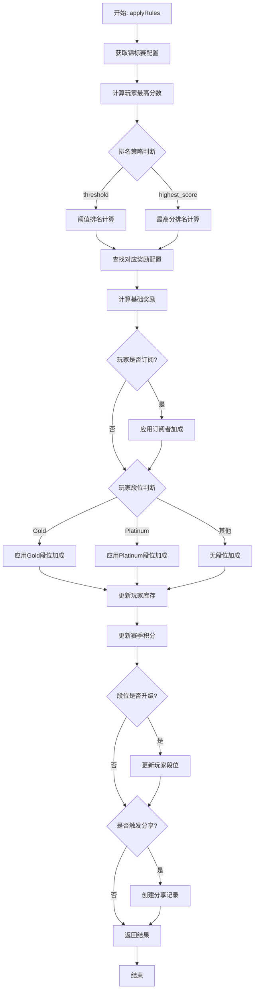
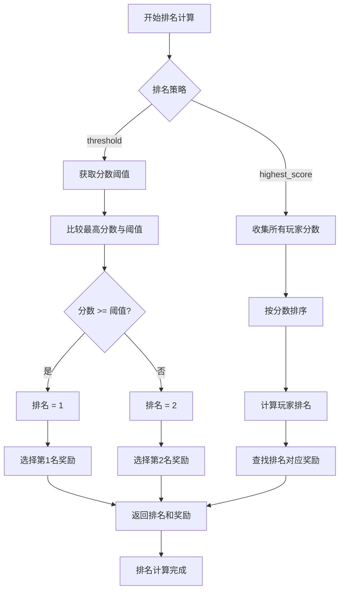
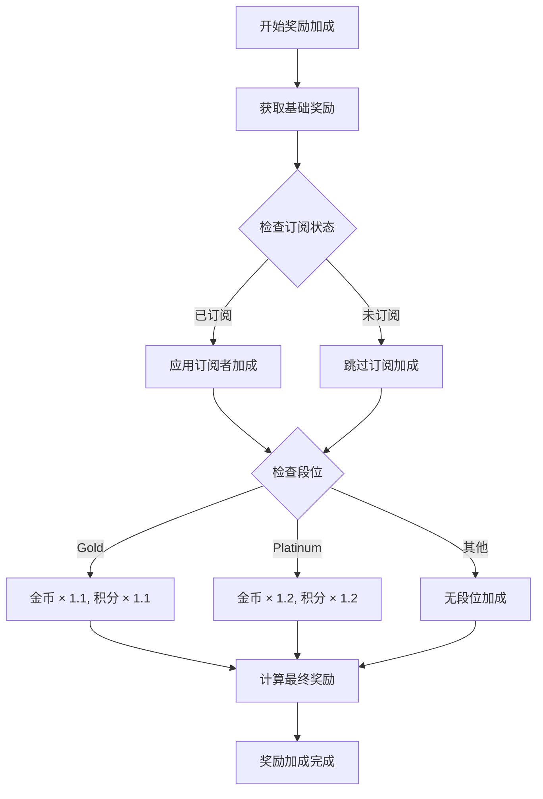
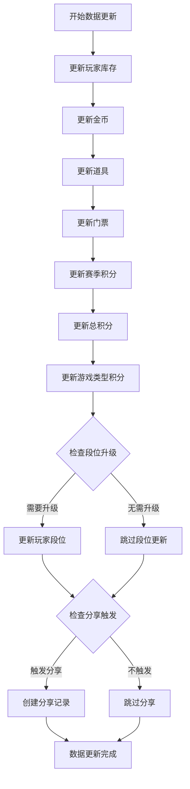

# applyRules 方法流程图

## 整体流程



## 详细子流程

### 1. 排名计算流程



### 2. 奖励加成流程



### 3. 数据更新流程



## 关键决策点

### 1. 排名策略选择
- **threshold**: 基于分数阈值的简单排名
- **highest_score**: 基于所有玩家分数的竞争排名

### 2. 奖励加成条件
- **订阅者**: 金币 × 1.2, 积分 × 1.5
- **Gold段位**: 金币 × 1.1, 积分 × 1.1
- **Platinum段位**: 金币 × 1.2, 积分 × 1.2

### 3. 段位升级条件
- **Bronze**: 0-999 积分
- **Silver**: 1000-4999 积分
- **Gold**: 5000-9999 积分
- **Platinum**: 10000+ 积分

### 4. 分享触发条件
- 配置中启用分享功能
- 随机概率检查通过
- 排名在指定范围内

## 数据流

### 输入数据
```typescript
{
  tournament: {
    config: {
      rules: { ranking: string, scoreThreshold?: number },
      rewards: Array<RewardConfig>,
      subscriberBonus: { coins: number, gamePoints: number },
      share: { probability: number, rankRange: [number, number] }
    }
  },
  uid: string,
  matches: Array<Match>,
  player: { isSubscribed: boolean, segmentName: string },
  inventory: { coins: number, props: Array, tickets: Array },
  playerSeason: { seasonPoints: number, gamePoints: Object }
}
```

### 输出数据
```typescript
{
  rank: number,
  finalReward: {
    coins: number,
    props: Array,
    gamePoints: number,
    tickets: Array
  }
}
```

### 数据库更新
1. **player_inventory**: 更新金币、道具、门票
2. **player_seasons**: 更新赛季积分和游戏积分
3. **players**: 更新段位（如果需要）
4. **player_shares**: 创建分享记录（如果触发）

## 错误处理

### 1. 配置错误
- 无效的排名策略
- 缺失的奖励配置
- 错误的排名范围

### 2. 数据错误
- 玩家数据不存在
- 库存数据缺失
- 赛季信息不完整

### 3. 计算错误
- 分数计算异常
- 奖励计算溢出
- 段位判断错误

## 性能考虑

### 1. 数据库操作优化
- 批量更新减少查询次数
- 使用索引提高查询效率
- 事务性操作确保一致性

### 2. 内存使用优化
- 使用 Map 进行快速查找
- 避免重复计算
- 及时释放临时变量

### 3. 并发处理
- 原子性操作避免竞态条件
- 乐观锁机制处理并发更新
- 错误重试机制

## 监控指标

### 1. 性能指标
- 方法执行时间
- 数据库查询次数
- 内存使用量

### 2. 业务指标
- 奖励分配成功率
- 段位升级频率
- 分享触发率

### 3. 错误指标
- 配置错误率
- 数据异常率
- 计算错误率 