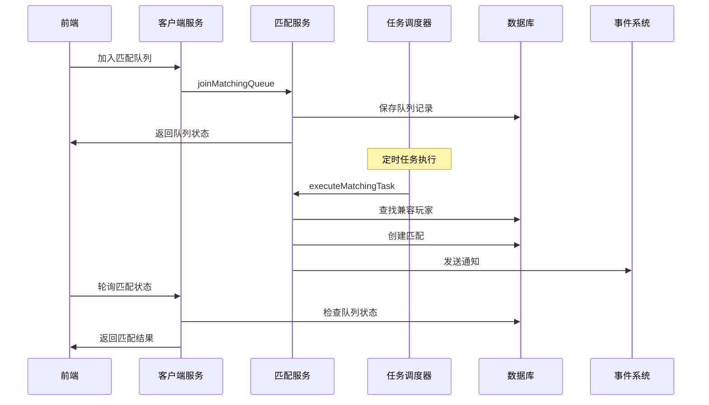

# 后台匹配架构使用指南

## 概述

后台匹配架构将匹配逻辑从实时处理中分离出来，通过定时任务来执行匹配，并通过事件系统通知结果。这种架构提供了更好的可扩展性、性能和用户体验。

## 架构设计

### 核心组件

1. **TournamentMatchingService**: 核心匹配服务
2. **MatchingScheduler**: 任务调度器
3. **MatchingClientService**: 前端客户端服务
4. **事件系统**: 通知和状态更新

### 工作流程



## 使用方式

### 1. 前端加入匹配队列

```typescript
// 使用前端客户端服务
const result = await convex.mutation("joinQueue", {
    uid: "player123",
    gameType: "solitaire",
    tournamentType: "quick_match",
    mode: "independent"
});

if (result.success) {
    console.log("已加入队列:", result.queueId);
    console.log("预计等待时间:", result.estimatedWaitTime);
    console.log("下次轮询时间:", result.nextPollTime);
    
    // 开始轮询
    startPolling(result.queueId, result.nextPollTime);
} else {
    console.error("加入队列失败:", result.error);
}
```

### 2. 轮询匹配状态

```typescript
class MatchPollingService {
    private pollingInterval: NodeJS.Timeout | null = null;
    private queueId: string;
    private uid: string;

    constructor(queueId: string, uid: string) {
        this.queueId = queueId;
        this.uid = uid;
    }

    async startPolling(initialDelay: number) {
        // 初始延迟
        setTimeout(() => {
            this.poll();
        }, initialDelay * 1000);
    }

    private async poll() {
        try {
            const result = await convex.query("checkMatchResult", {
                uid: this.uid,
                queueId: this.queueId
            });

            if (result.success) {
                if (result.matched) {
                    // 匹配成功
                    this.handleMatchSuccess(result);
                    this.stopPolling();
                } else if (result.cancelled || result.expired) {
                    // 匹配取消或过期
                    this.handleMatchCancelled(result);
                    this.stopPolling();
                } else if (result.waiting) {
                    // 继续等待
                    this.scheduleNextPoll();
                }
            } else {
                console.error("轮询失败:", result.error);
                this.scheduleNextPoll();
            }
        } catch (error) {
            console.error("轮询异常:", error);
            this.scheduleNextPoll();
        }
    }

    private scheduleNextPoll() {
        // 获取当前状态以确定下次轮询时间
        convex.query("getQueueStatus", {
            uid: this.uid,
            tournamentType: "quick_match",
            gameType: "solitaire",
            mode: "independent"
        }).then(status => {
            if (status.success && status.inQueue) {
                const nextPollTime = status.nextPollTime || 5;
                this.pollingInterval = setTimeout(() => {
                    this.poll();
                }, nextPollTime * 1000);
            }
        });
    }

    private handleMatchSuccess(result: any) {
        console.log("匹配成功!", result);
        // 进入游戏
        this.enterGame(result.gameId, result.serverUrl);
        
        // 显示通知
        this.showMatchNotification(result);
    }

    private handleMatchCancelled(result: any) {
        console.log("匹配已取消:", result.message);
        // 显示取消提示
        this.showCancelledMessage(result.message);
    }

    private enterGame(gameId: string, serverUrl: string) {
        // 进入游戏逻辑
        console.log(`进入游戏: ${gameId} at ${serverUrl}`);
    }

    private showMatchNotification(result: any) {
        // 显示匹配成功通知
        console.log(`匹配成功！找到 ${result.playerCount} 名玩家`);
    }

    private showCancelledMessage(message: string) {
        // 显示取消消息
        console.log(message);
    }

    stopPolling() {
        if (this.pollingInterval) {
            clearTimeout(this.pollingInterval);
            this.pollingInterval = null;
        }
    }
}

// 使用示例
const pollingService = new MatchPollingService(result.queueId, "player123");
pollingService.startPolling(result.nextPollTime);
```

### 3. 检查匹配通知

```typescript
// 定期检查匹配通知
async function checkMatchNotifications(uid: string) {
    const result = await convex.query("getMatchNotifications", {
        uid,
        limit: 5
    });

    if (result.success && result.notifications.length > 0) {
        for (const notification of result.notifications) {
            console.log("收到匹配通知:", notification);
            
            // 处理通知
            handleMatchNotification(notification);
            
            // 标记为已读
            await convex.mutation("markNotificationRead", {
                notificationId: notification.id
            });
        }
    }
}

function handleMatchNotification(notification: any) {
    const { matchId, tournamentId, gameId, serverUrl, playerCount } = notification.data;
    
    // 显示通知
    showNotification({
        title: notification.title,
        message: notification.message,
        action: () => enterGame(gameId, serverUrl)
    });
}
```

### 4. 取消匹配

```typescript
async function cancelMatch(uid: string, tournamentType: string, gameType: string) {
    const result = await convex.mutation("cancelMatching", {
        uid,
        tournamentType,
        gameType,
        reason: "user_cancelled",
        mode: "independent"
    });

    if (result.success) {
        console.log("已取消匹配");
        // 停止轮询
        pollingService.stopPolling();
    } else {
        console.error("取消匹配失败:", result.error);
    }
}
```

## 后台任务配置

### 1. 定时任务设置

```typescript
// 在 Convex 中配置定时任务
// convex/crons.ts
import { cronJobs } from "convex/server";
import { runMatchingTask, runCleanupTask } from "./service/tournament/matchingScheduler";

const crons = cronJobs();

// 每30秒执行一次匹配任务
crons.interval(
    "matching",
    { seconds: 30 },
    runMatchingTask,
    { batchSize: 50, maxProcessingTime: 30000 }
);

// 每5分钟执行一次清理任务
crons.interval(
    "cleanup",
    { minutes: 5 },
    runCleanupTask,
    {}
);

export default crons;
```

### 2. 任务监控

```typescript
// 监控任务执行状态
async function monitorTasks() {
    const stats = await convex.query("getTaskStats", { hours: 24 });
    
    console.log("任务统计:", {
        totalTasks: stats.totalTasks,
        successRate: `${stats.successRate.toFixed(2)}%`,
        averageProcessingTime: `${stats.averageProcessingTime}ms`,
        totalMatchedCount: stats.totalMatchedCount,
        totalCleanedCount: stats.totalCleanedCount
    });
}

// 获取最近任务
async function getRecentTasks() {
    const tasks = await convex.query("getRecentTasks", { 
        limit: 10,
        taskType: "matching"
    });
    
    console.log("最近任务:", tasks);
}
```

## 性能优化

### 1. 轮询策略

```typescript
class AdaptivePollingService {
    private baseInterval = 3; // 基础轮询间隔（秒）
    private maxInterval = 30; // 最大轮询间隔（秒）
    private currentInterval = this.baseInterval;

    calculateNextPollTime(waitTime: number): number {
        // 根据等待时间动态调整轮询间隔
        if (waitTime < 30) {
            this.currentInterval = this.baseInterval;
        } else if (waitTime < 60) {
            this.currentInterval = Math.min(this.currentInterval * 1.5, 10);
        } else if (waitTime < 120) {
            this.currentInterval = Math.min(this.currentInterval * 1.5, 15);
        } else {
            this.currentInterval = this.maxInterval;
        }
        
        return this.currentInterval;
    }
}
```

### 2. 批量处理

```typescript
// 后台任务批量处理配置
const batchConfig = {
    batchSize: 50,           // 每批处理50个队列条目
    maxProcessingTime: 30000, // 最大处理时间30秒
    maxConcurrency: 5        // 最大并发数5
};
```

### 3. 缓存策略

```typescript
// 缓存常用配置
const configCache = new Map();

async function getCachedConfig(tournamentType: string) {
    if (configCache.has(tournamentType)) {
        return configCache.get(tournamentType);
    }
    
    const config = await fetchTournamentConfig(tournamentType);
    configCache.set(tournamentType, config);
    
    // 5分钟后过期
    setTimeout(() => {
        configCache.delete(tournamentType);
    }, 5 * 60 * 1000);
    
    return config;
}
```

## 错误处理

### 1. 前端错误处理

```typescript
class MatchErrorHandler {
    static handleError(error: any, context: string) {
        console.error(`匹配错误 (${context}):`, error);
        
        switch (context) {
            case "join_queue":
                this.handleJoinError(error);
                break;
            case "polling":
                this.handlePollingError(error);
                break;
            case "notification":
                this.handleNotificationError(error);
                break;
            default:
                this.handleGenericError(error);
        }
    }
    
    private static handleJoinError(error: any) {
        // 处理加入队列错误
        if (error.message.includes("金币不足")) {
            showInsufficientCoinsDialog();
        } else if (error.message.includes("已达最大尝试次数")) {
            showMaxAttemptsDialog();
        } else {
            showGenericErrorDialog(error.message);
        }
    }
    
    private static handlePollingError(error: any) {
        // 处理轮询错误
        console.warn("轮询错误，将重试:", error);
        // 指数退避重试
    }
    
    private static handleNotificationError(error: any) {
        // 处理通知错误
        console.warn("通知错误:", error);
    }
    
    private static handleGenericError(error: any) {
        // 处理通用错误
        showGenericErrorDialog("匹配服务暂时不可用，请稍后重试");
    }
}
```

### 2. 后台错误处理

```typescript
// 后台任务错误处理
async function executeMatchingTaskWithRetry(ctx: any, params: any) {
    const maxRetries = 3;
    let retryCount = 0;
    
    while (retryCount < maxRetries) {
        try {
            return await MatchingScheduler.runMatchingTask(ctx, params);
        } catch (error) {
            retryCount++;
            console.error(`匹配任务失败 (重试 ${retryCount}/${maxRetries}):`, error);
            
            if (retryCount >= maxRetries) {
                // 记录最终失败
                await recordTaskFailure(ctx, params, error);
                throw error;
            }
            
            // 等待后重试
            await new Promise(resolve => setTimeout(resolve, 1000 * retryCount));
        }
    }
}
```

## 监控和告警

### 1. 关键指标

```typescript
// 监控关键指标
const metrics = {
    queueSize: 0,           // 队列大小
    averageWaitTime: 0,     // 平均等待时间
    matchSuccessRate: 0,    // 匹配成功率
    taskSuccessRate: 0,     // 任务成功率
    errorRate: 0           // 错误率
};

// 告警条件
const alerts = {
    queueSizeThreshold: 1000,      // 队列大小阈值
    waitTimeThreshold: 300,        // 等待时间阈值（秒）
    successRateThreshold: 0.8,     // 成功率阈值
    errorRateThreshold: 0.1        // 错误率阈值
};
```

### 2. 日志记录

```typescript
// 结构化日志
const logger = {
    info: (message: string, data: any) => {
        console.log(JSON.stringify({
            level: "info",
            message,
            timestamp: new Date().toISOString(),
            ...data
        }));
    },
    
    error: (message: string, error: any, context: any) => {
        console.error(JSON.stringify({
            level: "error",
            message,
            error: error.message,
            stack: error.stack,
            context,
            timestamp: new Date().toISOString()
        }));
    }
};
```

## 最佳实践

### 1. 前端实现

- 使用自适应轮询间隔
- 实现优雅的错误处理
- 提供清晰的用户反馈
- 支持取消匹配操作

### 2. 后台配置

- 根据负载调整任务频率
- 监控任务执行状态
- 实现合理的重试机制
- 记录详细的执行日志

### 3. 用户体验

- 显示实时等待时间
- 提供取消匹配选项
- 显示队列中的玩家数量
- 支持匹配通知推送

### 4. 性能优化

- 批量处理队列条目
- 缓存常用配置
- 优化数据库查询
- 实现智能轮询策略

## 故障排除

### 常见问题

1. **匹配超时**: 检查队列大小和匹配算法配置
2. **任务失败**: 检查数据库连接和权限
3. **轮询异常**: 检查网络连接和API状态
4. **通知丢失**: 检查事件系统和通知配置

### 调试工具

- 使用 `getQueueStats` 查看队列状态
- 使用 `getTaskStats` 查看任务统计
- 使用 `getRecentTasks` 查看最近任务
- 查看 `match_events` 表了解匹配过程

这种后台匹配架构提供了更好的可扩展性和用户体验，特别适合高并发的匹配场景。 