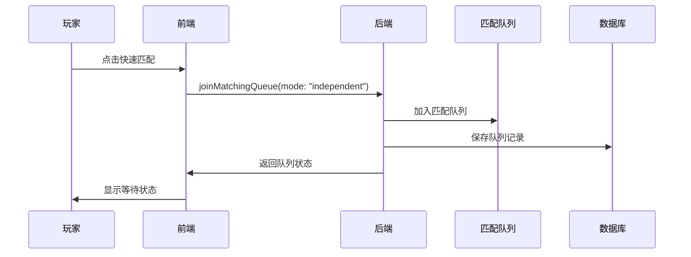
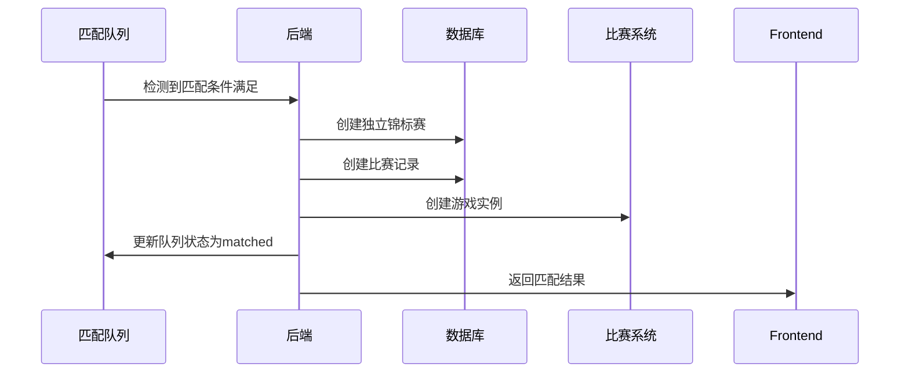
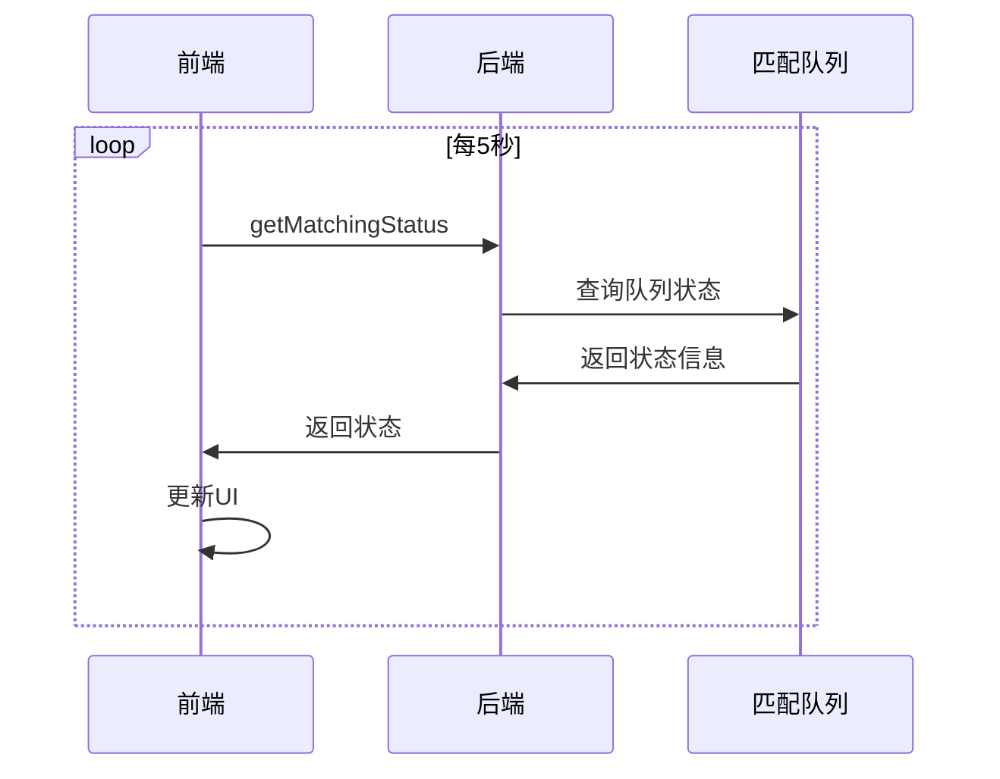

# 独立模式匹配服务使用指南

## 概述

独立模式是 `TournamentMatchingService` 的一种特殊匹配模式，它实现了"先匹配，后创建锦标赛"的逻辑。在这种模式下，玩家先加入匹配队列，当匹配成功后，系统会为这场比赛创建一个独立的锦标赛。

## 核心特性

### 1. 动态锦标赛创建
- 匹配成功后自动创建锦标赛
- 每场比赛都是独立的锦标赛实例
- 支持灵活的锦标赛配置

### 2. 智能匹配算法
- 基于技能、段位、ELO的匹配
- 支持多种匹配算法
- 实时兼容性计算

### 3. 队列管理
- 优先级队列
- 超时处理
- 状态监控

## 使用场景

### 1. 快速匹配模式
```typescript
// 玩家想要快速开始一场比赛，不需要等待特定锦标赛
const result = await convex.mutation("joinMatchingQueue", {
    uid: "player123",
    gameType: "solitaire",
    tournamentType: "quick_match",
    mode: "independent"
});
```

### 2. 自定义比赛
```typescript
// 玩家可以自定义比赛参数
const result = await convex.mutation("joinMatchingQueue", {
    uid: "player123",
    gameType: "chess",
    tournamentType: "custom_match",
    mode: "independent"
});
```

### 3. 临时锦标赛
```typescript
// 系统根据玩家需求动态创建锦标赛
const result = await convex.mutation("joinMatchingQueue", {
    uid: "player123",
    gameType: "poker",
    tournamentType: "temp_tournament",
    mode: "independent"
});
```

## API 接口

### 1. 加入独立模式匹配队列
```typescript
// 前端调用
const result = await convex.mutation("joinMatchingQueue", {
    uid: "player123",
    gameType: "solitaire",
    tournamentType: "quick_match",
    mode: "independent"
});

// 返回结果
{
    success: true,
    queueId: "queue_789",
    status: "matched" | "waiting",
    matchId?: "match_123",
    playerMatchId?: "player_match_456",
    tournamentId?: "tournament_999", // 独立模式下返回新创建的锦标赛ID
    gameId?: "game_789",
    serverUrl?: "remote_server_url",
    message: "匹配成功" | "等待匹配中",
    waitTime: 0
}
```

### 2. 获取独立模式匹配状态
```typescript
// 前端调用
const status = await convex.query("getMatchingStatus", {
    uid: "player123",
    tournamentType: "quick_match",
    gameType: "solitaire",
    mode: "independent"
});

// 返回结果
{
    inQueue: true,
    queueId: "queue_789",
    status: "waiting",
    waitTime: 45,
    priority: 150,
    algorithm: "skill_based",
    otherPlayers: 3,
    mode: "independent",
    message: "等待匹配中 (45秒，队列中还有3人)"
}
```

### 3. 取消独立模式匹配
```typescript
// 前端调用
const result = await convex.mutation("cancelMatching", {
    uid: "player123",
    tournamentType: "quick_match",
    gameType: "solitaire",
    reason: "user_cancelled",
    mode: "independent"
});

// 返回结果
{
    success: true,
    message: "已取消匹配"
}
```

### 4. 获取独立模式队列统计
```typescript
// 前端调用
const stats = await convex.query("getQueueStats", {
    tournamentType: "quick_match",
    gameType: "solitaire",
    mode: "independent"
});

// 返回结果
{
    success: true,
    stats: {
        totalWaiting: 15,
        averageWaitTime: 120,
        oldestWait: 300,
        algorithmDistribution: {
            "skill_based": 10,
            "random": 5
        },
        segmentDistribution: {
            "gold": 8,
            "platinum": 4,
            "silver": 3
        },
        priorityDistribution: {
            high: 5,
            medium: 7,
            low: 3
        },
        modeDistribution: {
            traditional: 0,
            independent: 15
        }
    }
}
```

## 配置示例

### 1. 锦标赛类型配置
```typescript
const tournamentTypeConfig = {
    typeId: "quick_match",
    name: "快速匹配",
    description: "快速开始一场比赛",
    gameType: "solitaire",
    isActive: true,
    priority: 1,
    entryRequirements: {
        isSubscribedRequired: false,
        entryFee: {
            coins: 100
        }
    },
    matchRules: {
        minPlayers: 2,
        maxPlayers: 4,
        isSingleMatch: true,
        rankingMethod: "highest_score"
    },
    rewards: {
        baseRewards: {
            coins: 200,
            gamePoints: 50,
            props: [],
            tickets: []
        },
        rankRewards: [
            {
                rankRange: [1, 1],
                multiplier: 2.0
            },
            {
                rankRange: [2, 2],
                multiplier: 1.5
            }
        ]
    },
    schedule: {
        duration: 1800 // 30分钟
    },
    advanced: {
        matching: {
            algorithm: "skill_based",
            maxWaitTime: 300,
            skillRange: 200,
            fallbackToAI: false
        }
    }
};
```

### 2. 前端使用示例
```typescript
class IndependentMatchService {
    private pollingInterval: NodeJS.Timeout | null = null;
    private maxWaitTime = 300; // 5分钟

    async joinQuickMatch(player: any) {
        try {
            const result = await convex.mutation("joinMatchingQueue", {
                uid: player.uid,
                gameType: "solitaire",
                tournamentType: "quick_match",
                mode: "independent"
            });

            if (result.status === "matched") {
                // 立即匹配成功
                this.handleMatchSuccess(result);
            } else {
                // 等待匹配，开始轮询
                this.startStatusPolling(player.uid, "quick_match", "solitaire");
            }

            return result;
        } catch (error) {
            console.error("加入快速匹配失败:", error);
            throw error;
        }
    }

    private startStatusPolling(uid: string, tournamentType: string, gameType: string) {
        this.pollingInterval = setInterval(async () => {
            try {
                const status = await convex.query("getMatchingStatus", {
                    uid,
                    tournamentType,
                    gameType,
                    mode: "independent"
                });

                if (status.inQueue) {
                    // 更新UI显示等待状态
                    this.updateWaitingUI(status.waitTime, status.otherPlayers);

                    // 检查是否超时
                    if (status.waitTime > this.maxWaitTime) {
                        this.handleTimeout();
                    }
                } else {
                    // 已匹配或已取消
                    this.stopPolling();
                }
            } catch (error) {
                console.error("状态轮询失败:", error);
            }
        }, 5000); // 每5秒轮询一次
    }

    private stopPolling() {
        if (this.pollingInterval) {
            clearInterval(this.pollingInterval);
            this.pollingInterval = null;
        }
    }

    private handleMatchSuccess(result: any) {
        console.log("匹配成功:", result);
        // 进入游戏
        this.enterGame(result.gameId, result.serverUrl);
    }

    private handleTimeout() {
        console.log("匹配超时");
        this.stopPolling();
        // 显示超时提示
        this.showTimeoutMessage();
    }

    private updateWaitingUI(waitTime: number, otherPlayers: number) {
        // 更新UI显示等待状态
        console.log(`等待匹配中... ${waitTime}秒，队列中还有${otherPlayers}人`);
    }

    private enterGame(gameId: string, serverUrl: string) {
        // 进入游戏逻辑
        console.log(`进入游戏: ${gameId} at ${serverUrl}`);
    }

    private showTimeoutMessage() {
        // 显示超时提示
        console.log("匹配超时，请稍后重试");
    }

    async cancelMatch(uid: string, tournamentType: string, gameType: string) {
        try {
            const result = await convex.mutation("cancelMatching", {
                uid,
                tournamentType,
                gameType,
                reason: "user_cancelled",
                mode: "independent"
            });

            this.stopPolling();
            return result;
        } catch (error) {
            console.error("取消匹配失败:", error);
            throw error;
        }
    }
}
```

## 工作流程

### 1. 玩家加入队列


### 2. 匹配成功创建锦标赛


### 3. 状态轮询


## 数据库结构

### 独立模式下的 matchingQueue 表
```typescript
{
    uid: "player123",
    tournamentId: null,           // 独立模式下为null
    gameType: "solitaire",
    tournamentType: "quick_match", // 独立模式下需要
    playerInfo: {
        uid: "player123",
        skill: 1500,
        segmentName: "gold",
        eloScore: 1200,
        totalPoints: 1500,
        isSubscribed: true
    },
    matchingConfig: {
        algorithm: "skill_based",
        maxWaitTime: 300,
        skillRange: 200,
        fallbackToAI: false
    },
    status: "waiting",
    priority: 150,
    weight: 1.2,
    metadata: {
        mode: "independent",
        config: {...},
        playerLevel: 10
    },
    createdAt: "2024-01-01T00:00:00Z",
    updatedAt: "2024-01-01T00:00:00Z"
}
```

### 独立锦标赛表结构
```typescript
{
    seasonId: "season_123",
    gameType: "solitaire",
    segmentName: "all",
    status: "open",
    tournamentType: "quick_match",
    isSubscribedRequired: false,
    isSingleMatch: true,          // 独立锦标赛是单场比赛
    prizePool: 320,               // 4个玩家 * 100金币 * 0.8
    config: {
        entryRequirements: {...},
        matchRules: {...},
        rewards: {...},
        schedule: {...},
        limits: {...},
        advanced: {...},
        independentMode: {        // 独立模式标识
            createdFromMatching: true,
            playerCount: 4,
            createdAt: "2024-01-01T00:00:00Z"
        }
    },
    createdAt: "2024-01-01T00:00:00Z",
    updatedAt: "2024-01-01T00:00:00Z",
    endTime: "2024-01-01T00:30:00Z"
}
```

## 性能优化

### 1. 索引优化
- 为独立模式添加专门的索引
- 优化查询性能
- 减少数据库负载

### 2. 缓存策略
- 缓存常用配置
- 缓存匹配算法结果
- 减少重复计算

### 3. 队列管理
- 定期清理过期队列
- 监控队列大小
- 防止内存泄漏

## 监控和告警

### 1. 关键指标
- 匹配成功率
- 平均等待时间
- 队列大小
- 锦标赛创建成功率

### 2. 告警条件
- 匹配成功率 < 80%
- 平均等待时间 > 5分钟
- 队列大小 > 1000
- 锦标赛创建失败率 > 5%

### 3. 日志记录
- 匹配事件日志
- 锦标赛创建日志
- 错误日志
- 性能日志

## 测试

### 运行独立模式测试
```typescript
// 运行完整测试
const testResult = await convex.mutation("runIndependentModeTest", {});

// 运行单个测试
const matchingTest = await convex.mutation("testIndependentModeMatching", {});
const statusTest = await convex.query("testIndependentModeStatus", {});
const statsTest = await convex.query("testIndependentModeStats", {});
```

### 测试覆盖
- 独立模式匹配测试
- 状态查询测试
- 统计查询测试
- 锦标赛创建测试
- 错误处理测试
- 性能测试

## 最佳实践

### 1. 前端实现
- 使用轮询而不是WebSocket
- 设置合理的轮询间隔
- 实现优雅的错误处理
- 提供清晰的用户反馈

### 2. 后端配置
- 根据游戏类型调整匹配参数
- 监控队列性能
- 实现合理的超时策略
- 记录详细的匹配日志

### 3. 用户体验
- 显示实时等待时间
- 提供取消匹配选项
- 显示队列中的玩家数量
- 提供匹配算法说明

## 故障排除

### 常见问题
1. **匹配超时**: 检查队列大小和匹配算法配置
2. **锦标赛创建失败**: 检查数据库连接和权限
3. **性能问题**: 检查索引和查询优化
4. **数据不一致**: 检查事务处理和错误处理

### 调试工具
- 使用 `getQueueStats` 查看队列状态
- 使用 `getMatchingStatus` 查看玩家状态
- 查看 `match_events` 表了解匹配过程
- 使用测试套件验证功能

## 扩展功能

### 1. 高级匹配
- 支持自定义匹配规则
- 实现动态匹配算法
- 支持团队匹配
- 支持跨服务器匹配

### 2. 智能优化
- 机器学习匹配算法
- 动态调整匹配参数
- 预测匹配时间
- 智能负载均衡

### 3. 社交功能
- 好友匹配
- 公会匹配
- 聊天功能
- 观战功能 