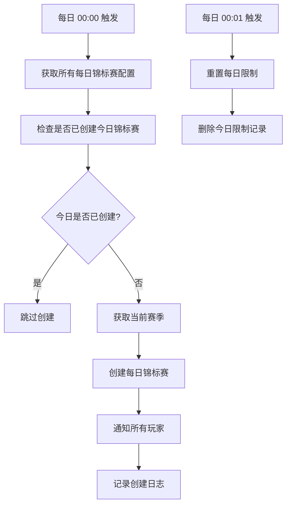
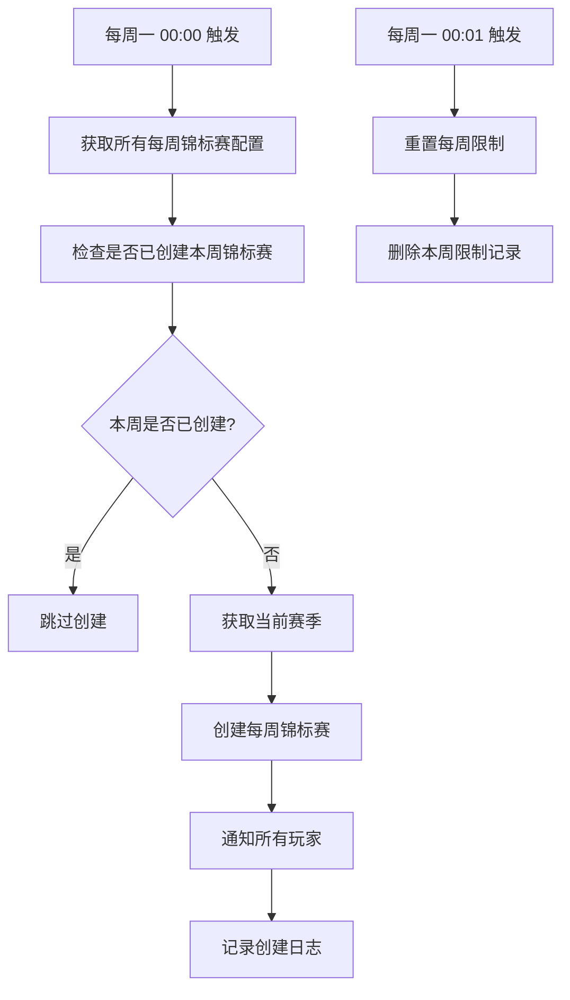
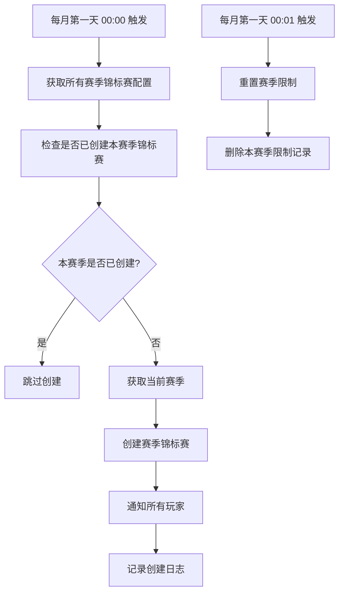

# 锦标赛调度器 (TournamentScheduler) 设计文档

## 概述

锦标赛调度器负责自动创建和管理 daily、weekly、seasonal 类型的锦标赛，确保锦标赛按照预定的时间表自动创建、清理和结算。

## 架构设计

### 1. 核心组件

#### 1.1 TournamentScheduler 类
- **位置**: `service/tournament/tournamentScheduler.ts`
- **功能**: 提供锦标赛创建、限制重置等核心功能
- **方法**:
  - `createDailyTournaments()` - 创建每日锦标赛
  - `createWeeklyTournaments()` - 创建每周锦标赛
  - `createSeasonalTournaments()` - 创建赛季锦标赛
  - `resetDailyLimits()` - 重置每日限制
  - `resetWeeklyLimits()` - 重置每周限制
  - `resetSeasonalLimits()` - 重置赛季限制

#### 1.2 定时任务配置
- **位置**: `crons.ts`
- **功能**: 配置自动执行的定时任务
- **任务**:
  - 每日 00:00 - 创建每日锦标赛
  - 每日 00:01 - 重置每日限制
  - 每周一 00:00 - 创建每周锦标赛
  - 每周一 00:01 - 重置每周限制
  - 每月第一天 00:00 - 创建赛季锦标赛
  - 每月第一天 00:01 - 重置赛季限制
  - 每日 02:00 - 清理过期锦标赛
  - 每小时 - 结算完成的锦标赛

#### 1.3 锦标赛服务扩展
- **位置**: `service/tournament/tournamentService.ts`
- **新增方法**:
  - `cleanupExpiredTournaments()` - 清理过期锦标赛
  - `settleCompletedTournaments()` - 结算完成的锦标赛

## 2. 锦标赛分类体系

### 2.1 分类定义
```typescript
export type TournamentCategory =
    | "daily"           // 每日锦标赛
    | "weekly"          // 每周锦标赛
    | "seasonal"        // 赛季锦标赛
    | "special"         // 特殊活动锦标赛
    | "ranked"          // 排位锦标赛
    | "casual"          // 休闲锦标赛
    | "championship"    // 冠军锦标赛
    | "tournament"      // 普通锦标赛;
```

### 2.2 时间配置结构
```typescript
export interface ScheduleConfig {
    // 开始时间
    startTime: {
        type: "fixed" | "daily" | "weekly" | "monthly" | "seasonal";
        value: string; // ISO string or cron expression
    };

    // 结束时间
    endTime: {
        type: "fixed" | "duration" | "until_completion";
        value: string | number; // ISO string or duration in seconds
    };

    // 持续时间
    duration: number; // 秒

    // 重复配置
    repeat?: {
        enabled: boolean;
        interval: "daily" | "weekly" | "monthly";
        daysOfWeek?: number[]; // 0-6, 0=Sunday
        dayOfMonth?: number;
    };

    // 时区
    timezone: string; // IANA timezone
}
```

## 3. 处理流程

### 3.1 每日锦标赛处理流程



### 3.2 每周锦标赛处理流程



### 3.3 赛季锦标赛处理流程



## 4. 数据模型

### 4.1 锦标赛类型配置
```typescript
interface TournamentType {
    typeId: string;
    name: string;
    description: string;
    category: TournamentCategory;
    gameType: GameType;
    isActive: boolean;
    priority: number;
    defaultConfig: TournamentConfig;
}
```

### 4.2 锦标赛实例
```typescript
interface Tournament {
    _id: string;
    seasonId: string;
    gameType: string;
    segmentName: string;
    status: "open" | "in_progress" | "completed" | "expired";
    playerUids: string[];
    tournamentType: string;
    isSubscribedRequired: boolean;
    isSingleMatch: boolean;
    prizePool: number;
    config: TournamentConfig;
    createdAt: string;
    updatedAt: string;
    endTime: string;
}
```

### 4.3 玩家限制记录
```typescript
interface PlayerTournamentLimits {
    _id: string;
    uid: string;
    gameType: string;
    tournamentType: string;
    date?: string;        // 每日限制
    weekStart?: string;   // 每周限制
    seasonId?: string;    // 赛季限制
    participationCount: number;
    tournamentCount: number;
    submissionCount: number;
    createdAt: string;
    updatedAt: string;
}
```

## 5. 配置示例

### 5.1 每日特殊锦标赛配置
```typescript
{
    typeId: "daily_special",
    name: "每日特殊锦标赛",
    description: "每日限时特殊锦标赛，提供丰厚奖励",
    category: "daily",
    gameType: "solitaire",
    isActive: true,
    priority: 1,
    defaultConfig: {
        entryRequirements: {
            minSegment: "bronze",
            isSubscribedRequired: false,
            entryFee: {
                coins: 50,
                tickets: {
                    gameType: "solitaire",
                    tournamentType: "daily_special",
                    quantity: 1
                }
            }
        },
        matchRules: {
            matchType: "single_match",
            minPlayers: 1,
            maxPlayers: 1,
            isSingleMatch: true,
            maxAttempts: 3,
            allowMultipleAttempts: true,
            rankingMethod: "highest_score"
        },
        schedule: {
            startTime: {
                type: "daily",
                value: "09:00"
            },
            endTime: {
                type: "duration",
                value: 86400 // 24小时
            },
            duration: 86400,
            timezone: "America/Toronto"
        }
    }
}
```

### 5.2 每周锦标赛配置
```typescript
{
    typeId: "weekly_championship",
    name: "每周冠军赛",
    description: "每周举行的冠军争夺赛",
    category: "weekly",
    gameType: "rummy",
    isActive: true,
    priority: 2,
    defaultConfig: {
        entryRequirements: {
            minSegment: "silver",
            isSubscribedRequired: false,
            entryFee: {
                coins: 100
            }
        },
        matchRules: {
            matchType: "multi_match",
            minPlayers: 2,
            maxPlayers: 4,
            isSingleMatch: false,
            maxAttempts: 1,
            allowMultipleAttempts: false,
            rankingMethod: "total_score"
        },
        schedule: {
            startTime: {
                type: "weekly",
                value: "monday 10:00"
            },
            endTime: {
                type: "duration",
                value: 604800 // 7天
            },
            duration: 604800,
            timezone: "America/Toronto"
        }
    }
}
```

## 6. 错误处理

### 6.1 常见错误场景
1. **无活跃赛季**: 当没有活跃赛季时，跳过锦标赛创建
2. **配置错误**: 当锦标赛配置无效时，记录错误并跳过
3. **数据库错误**: 当数据库操作失败时，记录错误日志
4. **通知失败**: 当通知玩家失败时，不影响主要流程

### 6.2 错误日志记录
```typescript
await ctx.db.insert("error_logs", {
    error: `创建每日锦标赛失败: ${error.message}`,
    context: "createDailyTournaments",
    tournamentType: config.typeId,
    createdAt: now.iso
});
```

## 7. 监控和日志

### 7.1 关键指标
- 锦标赛创建成功率
- 玩家参与度
- 限制重置成功率
- 清理和结算效率

### 7.2 日志记录
- 锦标赛创建日志
- 限制重置日志
- 错误日志
- 性能监控日志

## 8. 测试策略

### 8.1 单元测试
- 测试锦标赛创建逻辑
- 测试限制重置逻辑
- 测试时间计算逻辑

### 8.2 集成测试
- 测试完整的创建流程
- 测试与数据库的交互
- 测试通知系统

### 8.3 端到端测试
- 测试定时任务执行
- 测试玩家参与流程
- 测试结算流程

## 9. 部署和运维

### 9.1 部署检查清单
- [ ] 确保定时任务配置正确
- [ ] 验证数据库索引存在
- [ ] 检查错误日志监控
- [ ] 测试手动触发函数

### 9.2 运维监控
- 监控定时任务执行状态
- 监控锦标赛创建数量
- 监控系统性能指标
- 监控错误率

## 10. 扩展性考虑

### 10.1 支持新的锦标赛类型
- 添加新的分类类型
- 扩展配置结构
- 实现对应的处理逻辑

### 10.2 支持更复杂的时间规则
- 支持自定义 cron 表达式
- 支持时区转换
- 支持节假日规则

### 10.3 支持动态配置
- 支持运行时修改配置
- 支持 A/B 测试
- 支持灰度发布

## 11. 使用示例

### 11.1 手动创建每日锦标赛
```typescript
// 在 Convex 控制台或通过 API 调用
await ctx.runMutation(internal.service.tournament.tournamentScheduler.createDailyTournaments);
```

### 11.2 手动重置限制
```typescript
// 重置每日限制
await ctx.runMutation(internal.service.tournament.tournamentScheduler.resetDailyLimits);

// 重置每周限制
await ctx.runMutation(internal.service.tournament.tournamentScheduler.resetWeeklyLimits);

// 重置赛季限制
await ctx.runMutation(internal.service.tournament.tournamentScheduler.resetSeasonalLimits);
```

### 11.3 清理过期锦标赛
```typescript
// 手动清理过期锦标赛
await ctx.runMutation(internal.service.tournament.tournamentService.cleanupExpiredTournaments);
```

## 12. 总结

锦标赛调度器提供了一个完整的自动化系统来管理 daily、weekly、seasonal 锦标赛的生命周期。通过定时任务、配置管理和错误处理，确保锦标赛能够按照预定的时间表自动创建、管理和清理，为玩家提供持续的游戏体验。 